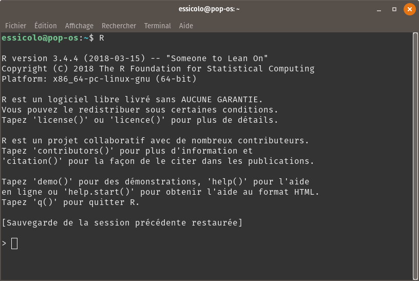
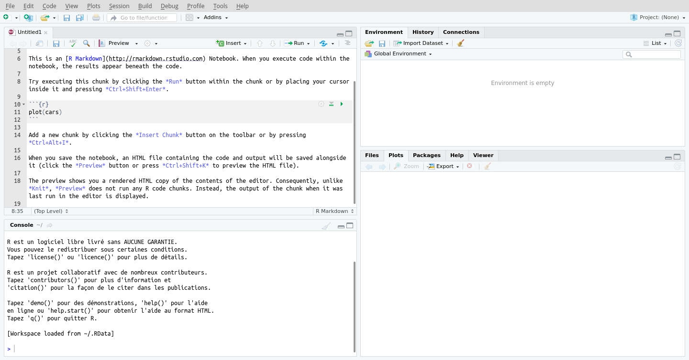

# La science des données avec R {#chapitre-intro-a-R}

 ***
️\ **Objectifs spécifiques**:

À la fin de ce chapitre,

- vous saurez contextualiser la science des données par rapport aux statistiques,

- vous serez en mesure de vous lancer dans un environnement de programmation R,

- vous serez en mesure d'effectuer des opérations de base en R,

- vous saurez différencier les grands types d'objets de R et

- vous saurez installer et charger des modules complémentaires.

***

## Organiser son environnement de travail en R

[**R**](https://www.r-project.org) est un langage de programmation dérivé du [**langage S**](https://fr.wikipedia.org/wiki/S_(langage)), qui fut initialement lancé en 1976.**R** figure parmi [**les langages de programmation les plus utilisés au monde**](https://www.tiobe.com/tiobe-index/).

<center></center>

Bien qu'il soit basé sur les **langages statiques [C](https://fr.wikipedia.org/wiki/C_(langage)) et [Fortran](https://fr.wikipedia.org/wiki/Fortran)**, **R** est un langage dynamique, c'est-à-dire que le code peut être exécuté ligne par ligne ou bloc par bloc : un avantage majeur pour des activités qui nécessitent des interactions fréquentes. 

Bien que **R** soit surtout utilisé pour le calcul statistique, il s'impose de plus en plus comme outil privilégié en sciences des données en raison des récents développements de modules d'analyse, de modélisation et de visualisation, dont plusieurs seront utilisés dans ce manuel.

## Préparer son flux de travail

Il existe de nombreuses manières d'installer **R**. Je couvrirai ici seulement l'installation classique.

### Installation classique de R

Sous [**Windows**](https://fr.wikipedia.org/wiki/Microsoft_Windows) ou [**Mac**](https://fr.wikipedia.org/wiki/Mac_OS), dirigez-vous [ici](https://cloud.r-project.org/), téléchargez et installez. 

Sous [**Linux**](https://fr.wikipedia.org/wiki/Linux), ouvrez votre gestionnaire d'application, chercher **`r-base`** (Ubuntu, Debian), **`R-base`** (openSuse) ou **`R-core`** (Fedora) et installez-le (assurez-vous que les librairies suivantes sont aussi installées: **`gcc`**, **`gcc-fortran`**, **`gcc-c++`** et **`make`**), vous aurez peut-être besoin d'installer des librairies supplémentaires pour faire fonctionner certains modules.

> **Note**. Les modules présentés dans ce cours devraient être disponibles sur Linux, Windows et Mac. Ce n'est pas le cas pour tous les modules R. La plupart fonctionnent néanmoins sur Linux, dont les systèmes d'opération sont de bonnes options pour le calcul scientifique. Je recommande [**Ubuntu**](https://www.ubuntu.com/download/desktop) ou l'une de ses dérivées.

### L'interpréteur de commandes RStudio

À cette étape, **R** devrait fonctionner dans un [**interpréteur de commande**](https://fr.wikipedia.org/wiki/Interpr%C3%A9teur_de_commandes). Si vous lancez **R** dans un terminal (chercher `cmd` dans le menu si vous êtes sur Windows), vous obtiendrez quelque chose comme ceci.

<center></center>

Le symbole **`>`** indique que **R** attend vos instructions. Vous voilà dans un état méditatif devant l'indéchiffrable vide du terminal. Afin de travailler dans un environnement de travail plus convivial, je recommande l'installation de l'interface [**RStudio**](https://www.rstudio.com/products/rstudio/download/), gratuite et open source. Téléchargez l'installateur et suivez les instructions. RStudio ressemble à ceci.

<center></center>

En haut à droite se trouve un menu **Project (None)**. Il s'agit d'un menu de vos projets. Je recommande d'utiliser ces projets avec **RStudio**, qui vous permettront de mieux gérer vos environnements de travail, en particulier en lien avec les chemins vers vos données, graphiques, etc., que vous pouvez gérer relativement à l'emplacement de votre dossier de projet plutôt qu'à l'emplacement des fichiers sur votre machine.

- En haut à gauche, vous avez vos feuilles de calcul, qui apparaîtront en tant qu'**onglets**. 

Vous pouvez prendre en main les **R notebooks**, dans lesquels vous pouvez écrire du texte en format [**Markdown**](https://github.com/adam-p/markdown-here/wiki/Markdown-Here-Cheatsheet) entre des blocs de code. Ceci vous permet de détailler votre flux de travail.

- En bas à gauche apparaît la Console, où vous voyez les commandes envoyées à R ainsi que ses sorties. Si vous travaillez en format **notebook**, vous n'en aurez probablement pas besoin.

- En haut à droite, les différents onglets indiquent où vous en êtes dans vos calculs. En particulier, la liste sous **Environment** indique les objets qui ont été générés jusqu'alors.

- En bas à droite, on retrouve des onglets de nature variés dont :

- **`Files`** contient les sous-dossiers et fichiers du dossier de projets. 
- **`Plots`** est l'endroit où apparaîtront vos graphiques. 
- **`Packages`** contient la liste des modules déjà installés, ainsi qu'un outil de gestion des modules pour leur installation, leur désinstallation et leur mise à jour. 
- **`Help`** affiche les fiches d'aide des fonctions (pour obtenir de l'aide sur une fonction dans RStudio, surlignez la fonction dans votre feuille de calcul, puis appuyez sur **`F1`**). 
- **`Viewer`** affichera les sorties **`HTML`**, en particulier les graphiques interactifs que vous générerez par exemple avec le module **`plotly`**.

### R markdown

Le format **R markdown** offre une approche de programmation littéraire, c'est-à-dire que vous écrivez votre code comme vous écrivez un article, une thèse ou une histoire. Cette approche permet de partager plus facilement vos codes, que ce soit avec une équipe de travail ou à la communauté scientifique pour accompagner un article scientifique en tant que matériel supplémentaire. 

Lorsque vous créez un notebook (**File > New file > R markdown**), les instructions de base apparaissent. Ajoutons que pour lancer du code ligne par ligne, vous pouvez surligner le code en question ou placez le curseur sur la ligne à exécuter, puis taper **`Ctrl + Enter`**. La sortie de R apparaîtra sous le bloc de code. 

Dans votre texte, vous pouvez ajouter des équations mathématiques en format **Mathjax** inspiré du format **Latex**. Par exemple `$a = \sum_{i=1}^n x_i^2$` sera affiché comme $a = \sum_{i=1}^n x_i^2$. Pour aider dans l'édition d'équation, vous pouvez utiliser un [éditeur dans les nuages](http://www.sciweavers.org/free-online-latex-equation-editor). 

Pour les titres, les caractères gras, l'insertion d'image, les hyperliens, les tableaux, etc., référez-vous à la documentation de [**Markdown**](https://github.com/adam-p/markdown-here/wiki/Markdown-Here-Cheatsheet).

Pour une meilleure compréhension de la notion d'interpréteur ou interface de commande, si votre environnement de travail était un avion, **R** serait le moteur et **RStudio** serait le cockpit !


## Premiers pas avec R

**R** ne fonctionne pas avec des menus, en faisant danser une souris sous une musique de clics. Vous devrez donc entrer des commandes avec votre clavier, **que vous apprendrez par cœur au fur et à mesure, ou que vous retrouverez en lançant des recherches sur internet**. Par expérience personnelle, lorsque je travaille avec R, j'ai toujours un navigateur ouvert prêt à recevoir une question.

Les étapes qui suivent sont des premiers pas. Elles ne feront pas de vous des *ceintures noires* de la programmation. La plupart des utilisateurs de **R** l'ont appris en se pratiquant sur leurs données, en frappant des murs, en apprenant comment les escalader ou les contourner...

Pour l'instant, ouvrez seulement un interpréteur de commande, et lancez **R**. Voyons si **R** est aussi libre qu'on le prétend.

> "La liberté, c'est la liberté de dire que deux et deux font quatre. Lorsque cela est accordé, tout le reste suit" [George Orwell, 1984](http://evene.lefigaro.fr/citation/liberte-liberte-dire-deux-deux-font-quatre-accorde-reste-suit-39731.php).

```{r}
2 + 2
```

Et voilà.


Les opérations mathématiques sont effectuées telles que l'on devrait s'attendre.

```{r}
67.1 - 43.3
```

```{r}
2 * 4
```

```{r}
1 / 2
```

L'exposant peut être noté **`^`**, comme c'est le cas dans **Excel**, ou `**` comme c'est le cas en Python.

```{r}
2^4
```

```{r}
2**4
```

```{r}
1 / 2 # utilisez des espaces de part et d'autre des opérateurs (sauf pour l'exposant) pour éclaircir le code.
```

**R** ne lit pas ce qui suit le caractère **`#`**. Cela vous laisse l'opportunité de commenter un code comprenant une séquence de plusieurs lignes. 

Remarquez également que la dernière opération comporte des espaces entre les nombres et l'opérateur **`/`**. Dans ce cas (*ce n'est pas toujours le cas*), les espaces ne signifient rien : ils aident seulement à éclaircir le code. 

Il existe des guides pour l'écriture de code en **R**. Je recommande le guide de style de [**Hadley Wickahm**](http://adv-r.had.co.nz/Style.html).

Assigner des **objets** à des **variables** est fondamental en programmation. En **R**, on assigne traditionnellement avec la flèche **`<-`**, mais vous verrez parfois le **`=`**, qui est davantage utilisé comme standard dans d'autres langages de programmation. 

Par exemple.

```{r}
a <- 3
```

Techniquement, **`a`** pointe vers le nombre entier **3**. Conséquemment, on peut effectuer des opérations sur **`a`**.

```{r}
a * 6
```

```{r}
#A + 2
```

Le message d'erreur nous dit que **`A`** n'est pas défini. Sa version minuscule, **`a`**, l'est pourtant. La raison est que **R** considère la **case** dans la définition des objets. Utiliser la mauvaise case mène donc à des erreurs.

**Note**. Les messages d'erreur ne sont pas toujours clairs, mais vous apprendrez à les comprendre. Dans tous les cas, ils sont faits pour vous aider. **Lisez-les attentivement !**

En général, le nom d'une variable doit toujours commencer par une lettre, et ne doit pas contenir de caractères réservés (espaces, `+`, `*`, accent). Dans la définition des variables, certains utilisent le point (**`.`**) pour délimiter les mots, mais la barre de soulignement (**`_`**) est à préférer. En effet, dans d'autres langages de programmation comme Python, le point **`.`** a une autre signification. Son utilisation est à éviter autant que possible.

**Note**. À ce stade, vous serez probablement plus à l'aise de copier-coller ces commandes dans votre terminal.

```{r}
rendement_arbre <- 50 # pomme/arbre
nombre_arbre <- 300 # arbre
nombre_pomme <- rendement_arbre * nombre_arbre
nombre_pomme
```

Comme pour la plupart des langages de programmation, **R** respecte les conventions des [**priorités des opérations mathéatiques**](https://fr.wikipedia.org/wiki/Ordre_des_op%C3%A9rations).

```{r}
10 - 9^0.5 * 2
```

### Types de données

Jusqu'à maintenant, nous n'avons utilisé que :

- des **nombres entiers** (*integer* ou **`int`**) 
- et des **nombres réels** (*numeric* ou **`float64`**). 

**R** inclut d'autres types. La **chaîne de caractère** (*string* ou *character*) contient un ou plusieurs symboles. Elle est définie entre des doubles guillemets `" "` ou des apostrophes **`' '`**. Il n'existe pas de standard sur l'utilisation de l'un ou de l'autre, mais en règle générale, on utilise les apostrophes pour les expressions courtes, contenant un simple mot ou séquence de lettres, et les guillemets pour les phrases. Une raison pour cela : les guillemets sont utiles pour insérer des apostrophes dans une chaîne de caractère.

```{r}
a <- "L'ours"
b <- "polaire"
paste(a, b)
```

On **colle** **`a`** et **`b`** avec la fonction **`paste()`**. Notez que l'objet **`a`** a été défini précédemment. Il est possible en **R** de réassigner une variable, mais cela peut porter à confusion, jusqu'à générer des erreurs de calcul si une variable n'est pas assignée à l'objet auquel on voulait référer.

Combien de caractères contient la chaîne **`"L'ours polaire"`** ? **R** sait compter. Demandons-lui.

```{r}
c <- paste(a, b)
nchar(c)
```

Quatorze, c'est bien cela (comptez "L'ours polaire", en incluant l'espace). Comme **`paste`**, `nchar` est une fonction incluse par défaut dans l'environnement de travail de **R** : plus précisément, ces fonctions sont incluses dans le module **`base`**, inclut par défaut lorsque **R** est lancé. La fonction est appelée en écrivant **`nchar()`**. Mais une fonction de quoi ? Des **arguments**, qui se trouvent entre les parenthèses. Dans ce cas, il y a un seul argument: **`c`**.

En calcul scientifique, il est courant de lancer des requêtes pour savoir si un résultat est vrai (**`TRUE, True`**) ou faux (**`FALSE, False`**).

```{r}
# Postulat
a <- 17
```

```{r}
# Ceci pour vérifier si a est inférieur à 10.
a < 10
```

```{r}
# Ceci pour vérifier si a est supérieur à 10.
a > 10
```

```{r}
# Ceci pour vérifier si a égal à 10.
a == 10
```

```{r}
# Ceci pour vérifier si a est différent de 10.
a != 10
```

```{r}
# Ceci pour vérifier si a est égal à 17.
a == 17
```

```{r}
# Ceci pour vérifier si a est différent de 17.
!(a == 17)
```

Je viens d'introduire un nouveau type de données : les **données booléennes** (en anglais *boolean*, ou **`logical`**), qui ne peuvent prendre que deux états - **`TRUE`** ou **`FALSE`**. 

Puis, on a vu plus haut que le symbole **`=`** est réservé pour assigner des objets : pour les tests d'égalité, on utilise le double égal, **`==`**, ou **`!=`** pour la non-égalité. 
Enfin, pour inverser une donnée de type booléenne, on utilise le point d'exclamation **`!`**.

### Les collections de données

Les exercices précédents ont permis de présenter les types de données offerts par défaut sur **R** qui sont les plus importants pour le calcul scientifique : 

- **`int`** (*integer*, ou nombre entier), 
- **`numeric`** (nombre réel), 
- **`character`** (*string*, ou chaîne de caractère) 
- et **`logical`** (booléen). 

D'autres s'ajouteront tout au long du cours, comme les catégories (**`factor`**) et les unités de temps (date-heure).

Lorsque l'on procède à des opérations de calcul en science, on utilise rarement des valeurs uniques. L'on préfère les organiser et les traiter en collections. Par défaut, **R** offre quatre types importants de collections : 

- les **vecteurs**, 
- les **matrices**, 
- les **listes** 
- et les **tableaux**.

#### Les Vecteurs

D'abord, les **vecteurs** sont une *série de variables de même type*. Un vecteur est délimité par la fonction **`c()`** (**`c`** pour **c**oncaténation). Les éléments de la liste sont séparés par des virgules.

```{r}
espece <- c('Petromyzon marinus', 'Lepisosteus osseus', 'Amia calva', 'Hiodon tergisus')
espece
```

Pour accéder aux éléments d'une liste, appellez la liste suivie de la position de l'objet désiré entre crochets.

```{r}
espece[1] # l'espèce à la position 1
```

```{r}
espece[2]  # l'espèce à la position 2
```

```{r}
espece[1:3]  # les espèce des positions 1 à 3
```

```{r}
espece[c(1, 3)]  # les espèces aux positions 1 et 3
```

On peut noter que le premier élément de la liste est noté **`1`**, et non **`0`** comme c'est le cas de la plupart des autres langages. Le raccourcis **`1:3`** crée une liste de nombres entiers de **`1`** à **`3`** inclusivement, c'est-à-dire l'équivalent de **`c(1, 2, 3)`**. En effet, on crée une liste d'indices pour soutirer des éléments d'une liste. On peut utiliser le symbole de soustraction pour retirer un ou plusieurs éléments d'un vecteur.

```{r}
espece[-c(1, 3)] # le vecteur espece sans les éléments aux positions 1 et 3
```

Pour ajouter un élément à notre liste, on peut utiliser également la fonction **`c( )`**.

```{r}
espece <- c(espece, "Cyprinus carpio") # ajoute l'espèce Cyprinus carpio au vecteur
espece
```

Notez que l'on efface l'objet **`espece`** par une concaténation de l'objet **`espece`**, précédemment définie, et d'un autre élément.

En lançant **`espece[3] <- "Lepomis gibbosus"`**, il est possible de changer un élément de la liste.

```{r}
espece[3] <- "Lepomis gibbosus"
espece
```

#### Les Matrices

Une **matrice** est un vecteur de dimension plus élevée que 1. En écologie, on dépasse rarement la deuxième dimension, quoi que les matrices en **`N`** dimensions soient courantes en modélisation mathématique. Je ne considérerai pour le moment que des matrices **`2D`**. 

Comme c'est la cas des vecteurs, **les matrices contiennent des valeurs de même type**. En **R**, on peut attribuer aux matrices `2D` des noms de ligne et de colonne.

```{r}
mat <- matrix(c(1, 2, 3, 4, 5, 6, 7, 8, 9, 10, 11, 12), ncol=3)
mat
```

```{r}
colnames(mat) <- c('A', 'B', 'C')
rownames(mat) <- c('site_1', 'site_2', 'site_3', 'site_4')
mat
```

On peut soutirer les noms de colonne et les noms de ligne. Le résultat est un vecteur.

```{r}
colnames(mat)
```

```{r}
rownames(mat)
```

#### Les Listes

Les **listes** sont des collections hétérogènes dans lesquelles on peut placer les objets désirés, sans distinction. Elles peuvent même inclure d'autres listes. Chacun des éléments de la liste peut être identifié par une clé. Pour les créer on utilise la fonction `list()`.

```{r}
ma_liste <- list(especes = c('Petromyzon marinus', 'Lepisosteus osseus',
                             'Amia calva', 'Hiodon tergisus'),
                site = 'A101',
                stations_meteos = c('746583', '783786', '856363'))
ma_liste
```

Les éléments de la liste peuvent être soutirés par le nom de la clé ou par l'indice, de cette manière.

```{r}
ma_liste$especes
ma_liste[[1]] # notez qu'il y a double crochets ici !
```

**Exercice**. Accéder au deuxième élément du vecteur d'espèces dans la liste **`ma_liste`**.

#### Les Tableaux

Enfin, le type de collection de données le plus important est le tableau, ou **`data.frame`**. Techniquement, **il s'agit d'une liste composée de vecteurs de même longueur**. Chaque colonne peut ainsi prendre un type de donnée indépendamment des autres colonnes.

```{r}
tableau <- data.frame(espece = c('Petromyzon marinus', 'Lepisosteus osseus',
                                'Amia calva', 'Hiodon tergisus'),
                     poids = c(10, 13, 21, 4),
                     longueur = c(35, 44, 50, 8))
tableau
```

En programmation classique en **R** (nous verrons plus loin la méthode **`tidyverse`**), les éléments d'un tableau se manipulent comme ceux d'une matrice et les colonnes peuvent être appelés comme les éléments d'une liste.

```{r}
tableau[, 2:3] # tirer un sous tableau avec seulement les colonnes 2 et 3 (2 à 3)
tableau$poids  # seulement les valeurs de la colonne "poids"
```

Vous verrez aussi, quoi que rarement, ce format, qui à la différence du format **`$`**, génère un tableau :

```{r}
tableau['poids']
```

Le tableau est le format de collection à privilégier pour manipuler des données. Récemment, le format de tableau **`tibble`** a été créé par l'équipe de **RStudio** pour offrir un format plus moderne.

### Les fonctions

Lorsque vous écrivez une commande suivit de parenthèses, comme **`data.frame(especes = ...)`**, vous demandez à **R** de passer à l'action en appelant une fonction. 

De manière très générale, une fonction transforme quelque chose en quelque chose d'autre.


Par exemple, la fonction **`mean()`** prend une collection de nombre comme entrée, puis en sort ... vous devinez quoi ?.

```{r}
mean(tableau$poids)
```

Les entrées sont appelés les **arguments** de la fonction. Leur définition est toujours disponible dans la documentation.

**Exercice** :

Familiarisez-vous avec la documentation de **R** en lançant **`?mean`**. 

Truc : si vous avez pris de l'avance et que vous travaillez déjà en **RStudio**, mettez le terme en surbrillance, puis appuyez sur **F1**.

Vous verrez dans la documentation que la fonction `mean()` demande trois arguments, `x`, **`trim`** et **`na.rm`**. Or nous avons seulement placé un vecteur, sans spécifier d'argument !

En effet. En l'absence d'une définition des arguments, **R** supposera que les arguments dans la parenthèse, séparés par une virgule, sont présentés dans le même ordre que celui spécifié dans la définition de la fonction (celle qui est présentée dans le fichier d'aide). 

> Dans le cas qui nous intéresse, **`mean(tableau$poids)`** est équivalent à **`mean(x = tableau$poids)`**.

Maintenant, selon la fiche d'aide, l'argument **`na.rm`** est une valeur logique spécifiant si oui (**`TRUE`**) ou non (**`FALSE`**) les valeurs manquantes doivent être considérées. 

> Une moyenne d'un vecteur comprenant au moins un **`NA`** sera **`NA`**. 

```{r}
mean(c(6, 1, 7, 4, 9, NA, 1))
```

En ne spécifiant rien, **R** prend la valeur par défaut, telle que spécifiée dans la documentation. 

Il en va de même pour l'argument **`trim`**, qui permet d'élaguer des valeurs extrêmes. Dans la fiche d'aide,  **`mean(x, trim = 0, na.rm = FALSE, ...)`** signifie que par défaut, l'argument **`x`** est vide (il doit donc être spécifié), l'argument **`trim`** est de **`0`** et l'argument **`na.rm`** est **`FALSE`**.

```{r}
mean(c(6, 1, 7, 4, 9, NA, 1), na.rm = TRUE)
```

**Vous n'êtes pas emprisonné par les fonctions offertes par R**. Vous pouvez installer des modules qui complètent les fonctions de base de **R**. On le verra un peu plus loin dans ce chapitre. Mais pour l'instant, voyons comment vous pouvez créer vos propres fonctions.

Disons que vous voulez créer une fonction qui calcule la sortie de $x^3-2y+a$. Pour obtenir la réponse on a besoin des arguments **`x`**, **`y`** et **`a`**. La sortie de la fonction est ici triviale (évidente) : la réponse de l'équation. L'opération **`function()`** permet de prendre ça en charge.

```{r}
operation_f <- function(x, y, a = 10) {
    return(x^3 - 2*y + a)
}
```

Notez que **`a`** (la constante) a une valeur par défaut. 

La sortie de la fonction est ce qui se trouve entre les parenthèses de **`return()`**. Vous pouvez maintenant utiliser la fonction **`operation_f`** au besoin.

```{r}
operation_f(x = 2, y = 3, a = 1)
```

Une telle fonction est peu utile. Mais l'utilisation de fonctions personnalisées vous permettra d'éviter de répéter la même opération plusieurs fois dans un flux de travail, en évitant de générer trop de code, donc aussi de potentielles erreurs. Personnellement, j'utilise les fonctions surtout pour générer des graphiques personnalisés.

**Exercice** : 

Afin d'acquérir de l'autonomie, vous devrez être en mesure de trouver le nom des commandes dont vous avez besoin pour effectuer la tâche que vous désirer effectuer. Cela peut causer des frustrations, mais vous vous sentirez toujours plus à l'aise avec **R** jour après jour. 

L'exercice ici est de trouver par vous-même la commande qui vous permettra de mesurer la longueur d'un vecteur.

```{r}
vec1 <- c(1, 2, 3)
length(vec1)  # donne 3, car vec contient 3 éléments
```

```{r}
vec2 <- c(4, 5, 6, 7, 8)
length(vec2) # donne 5, car vec2 contient 5 éléments 
```

### Les boucles

#### Boucles for

Les boucles permettent d'effectuer une même suite d'opérations sur plusieurs objets. Pour faire suite à notre exemple, nous désirons obtenir le résultat de l'opération *f* pour des paramètres que nous enregistrons dans ce tableau.

```{r}
params <- data.frame(x = c(2, 4, 1, 5, 6),
                     y = c(3, 4, 8, 1, 0),
                     a = c(6, 1, 8, 2, 5))
params
```

Nous créons un vecteur vide, puis nous itérons ligne par ligne en remplissant le vecteur.

```{r}
operation_res <- c()
for (i in 1:nrow(params)) {
    operation_res[i] <- operation_f(x = params[i, 1], y = params[i, 2], a = params[i, 3])
}
operation_res
```

En faisant varier `i` sur des valeurs du vecteur donné par la séquence de nombre entiers de 1 au nombre de ligne du tableau de paramètres, nous demandons à **R** d'effectuer la suite d'opération entre les accolades **`{ }`**. À chaque boucle, **`i`** prend une valeur de la séquence. **`i`** est utilisé ici comme indice de la ligne à soutirer du tableau **`params`**, qui correspond à l'indice dans le vecteur **`operation_res`**.

Ainsi, chaque résultat est calculé dans l'ordre des lignes du tableau de paramètres **`params`** et l'on pourra très bien y coller nos résultats :

```{r}
params$resultats <- operation_res
params
```

Notez que puisque la colonne **`resultat`** n'existe pas dans le tableau **`params`**, R crée automatiquement une nouvelle colonne.

Les boucles **`for`** vous permettront par exemple de générer en peu de temps 10, 100, 1000 graphiques (*autant que vous voulez*), chacun issu de simulations obtenues à partir de conditions initiales différentes, et de les enregistrer dans un répertoire sur votre ordinateur. 

Notez qu'un travail qui pourrait prendre des semaines sur **Excel** peut être effectué en **R** en quelques secondes.

#### Boucles while

Un second outil est disponible pour les itérations : les boucles **`while`**. Elles effectuent une opération tant qu'un critère n'est pas atteint. Elles sont utiles pour les opérations où l'on cherche une convergence. Je les couvre rapidement puisqu'elles sont rarement utilisées dans les flux de travail courants. 

En voici un petit exemple.

```{r}
x <- 100
while (x > 1.1) {
    x <- sqrt(x)
    print(x)
}
```

Voici comment ceci s'interprète :

- Nous avons initié (ou initialisé) **`x`** à une valeur de **`100`**. 
- Puis, tant que (**`while`**) le test **`x > 1.1`** est vrai, on demande d'attribuer à **`x`** une nouvelle valeur calculée en extrayant la racine de la valeur précédente de **`x`**. 
- Enfin, indiquer la valeur avec **`print()`**.

### Conditions : if, else if, else

> Si la condition **`1`** est remplie, effectuer une suite d'instruction **`1`**. Si la condition **`1`** n'est pas remplie, et si la condition **`2`** est remplie, effectuer la suite d'instruction **`2`**. Sinon, effectuer la suite d'instruction **`3`**.

Voilà comment on exprime une suite de conditions. Elles peuvent être aussi longues selon le problème à traiter. Prenons l'exemple simple d'une discrétisation d'une valeur continue. 

- Si $x<10$, il est classé comme faible. 
- Si $10 \leq x <20$, il est classé comme moyen. 
- Si $x \geq 20$, il est classé comme élevé. 

Plaçons cette classification dans une fonction.

```{r}
classification <- function(x, lim1=10, lim2=20)  {
    if (x < lim1) {
        categorie <- "faible"
    } else if (x < lim2) {
        categorie <- "moyen"
    } else {
        categorie <- "élevé"
    }
    return(categorie)
}
classification(-10)
classification(15.4)
classification(1000)
```

Une condition est définie avec le **`if`**, suivi du test à vrai ou faux entre parenthèses. Si le test retourne un **vrai** (**`TRUE`**), l'instruction entre accolades est exécutée. Si elle est fausse, on passe au suivant.

**Exercice**

Explorer les commandes **`ifelse`** et **`cut`** et réfléchissez à la manière qu'elles pourraient être utilisées pour effectuer une discrétisation plus efficacement qu'avec les **`if`** et les **`else`**.

La commande **`ifelse`** est une version simplifiée des combinaisons des **`if`** et des **`else`** pour une catégorisation en deux classes.

```{r}
#ifelse(logical_expression, a , b)
```

1.l'**expression logique** indique un vecteur d'entrée, qui à son tour renverra un vecteur de même taille à la sortie.
2. **a** est retourné lorsque l'expression logique est vraie.
3. **b** est retourné lorsque l'expression logique est fausse.

```{r}
class_ifese <- function(x, lim1=10)  {
    ifelse (x < lim1, "faible", "élevé") 
}

class_ifese(-10)
class_ifese(15.4)
class_ifese(1000)
```

La commande ou fonction **`cut()`** utilise en entrée un vecteur de plus de **1D**. Il faut une série de nombres.

```{r}
vec2 <- rbinom(40, 100, 0.5)
cut(vec2, breaks = c(43, 48, 52,58, 60))
```

- **`breaks`** specifie les points de coupe
- **`labels`** les nouvelles catégories ou classes.

```{r}
data = c(1200, 34567, 3456, 12, 3456, 0985, 1211)
cut_res = cut(data, 3,labels = c('XXS', 'XS', 'S'))
cut_res
table(cut_res)
```

### Installer et charger un module

La plupart des opérations d'ordre général comme :

- les racines carrées, 
- les tests statistiques, 
- la gestion de matrices et de tableau, 
- les graphiques, etc.

sont accessibles grâce aux modules de base de R, qui sont installés et chargés par défaut lors du démarrage de R. 

Des équipes de travail ont néanmoins développé plusieurs modules pour répondre à leurs besoins spécialisés, et les ont laissées disponibles au grand public dans des modules que vous pouvez installer d'un dépôt **CRAN** (le AppStore de **R**), d'un dépôt **Anaconda** (le AppStore de **Anaconda**, si vous utilisez cette plate-forme), d'un dépôt **Github** (dépôts décentralisés), etc.

**RStudio** possède un bouton pratique **Install** qui vous permet d'y inscrire une liste de modules. Le navigateur anaconda offre aussi une interface d'installation. La commande **R** pour installer un module est **`install.packages("ggplot2")`**, si par exemple vous désirez installer **`ggplot2`**, le module graphique par excellence en **R**. C'est la commande que RStudio lancera tout seul si vous lui demandez d'installer **`ggplot2`**.

Les modules sont l'équivalent des applications spécialisées que vous installez sur un téléphone mobile. Pour les utiliser, il faut les ouvrir.

Généralement, j'ouvre toutes les applications nécessaires à mon flux de travail au tout début de ma feuille de calcul (la prochaine cellule retournera un message d'erreur si les packages ne sont pas installés).

```{r, message = FALSE, warning = FALSE}
library("tidyverse") # méta-package qui charge entre autres dplyr et ggplot2
library("vegan")
library("nlme")
```

Les modules sont installés sur votre ordinateur à un endroit que vous pourrez retrouver avec la commande **`.libPaths()`**.

**Exercice** : 

À partir d'ici jusqu'à la fin du cours, nous utiliserons **RStudio**. Ouvrez-le et familiarisez-vous avec l'interface! Quelques petits trucs :

- pour lancer une ligne, placez votre curseur sur la ligne, puis appuyez sur **`Ctrl + Enter`**

- pour lancer une partie de code précise, mettez la en surbrillance, puis **`Ctrl + Enter`**

- utilisez toujours le gestionnaire de projets, en haut à droite !

- installez le module **`tidyverse`**

- lancez data(iris) pour obtenir un tableau d'exercice, puis cliquez sur l'objet dans la fenêtre environnement

- essayer R notebook

## Enfin...

Comme une langue, on apprend à s'exprimer en un langage informatique qu'en se mettant à l'épreuve, ce que vous ferez tout au long de ce cours. Pour vous encourager, voici quelques trucs pour apprendre à coder en **R**.

- **R n'aime pas l'ambiguïté**. Une simple virgule mal placée et il ne sait plus quoi faire. Cela peut être frustrant au début, mais cette rigidité est nécessaire pour effectuer du calcul scientifique.

- **Le copier-coller est votre ami**. En gardant à l'esprit que vous être responsable de votre code et que vous respectez les droits d'auteur, n'ayez pas peur de copier-coller des lignes de code et de personnaliser par la suite.

- **L'erreur que vous obtenez: d'autres l'ont obtenue avant vous**. Le site de question-réponse [stackoverflow](https://stackoverflow.com/questions/tagged/r) est une ressource inestimable où des gens ayant posté des questions ont reçu des réponses d'experts (les meilleures réponses et les meilleures questions apparaissent en premier). Apprenez à chercher intelligemment des réponses en formulant précisément vos questions !

- **Étudiez et pratiquez**. Les messages d'erreur en **R** sont courants, même chez les personnes expérimentées. La meilleure manière d'apprendre une langue est de la parler, d'étudier ses susceptibilités, de les tester dans une conversation, etc.
