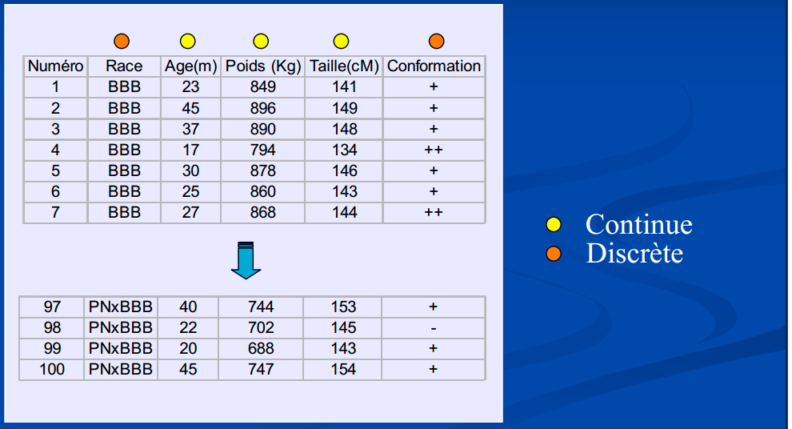
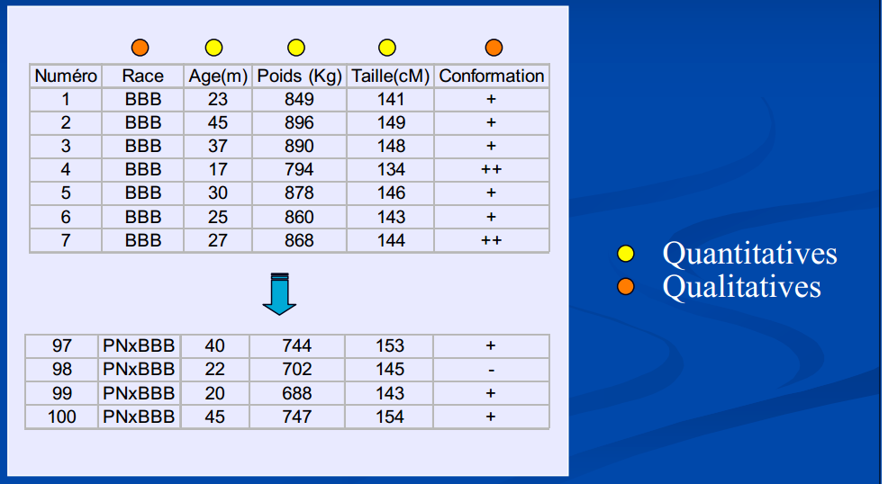
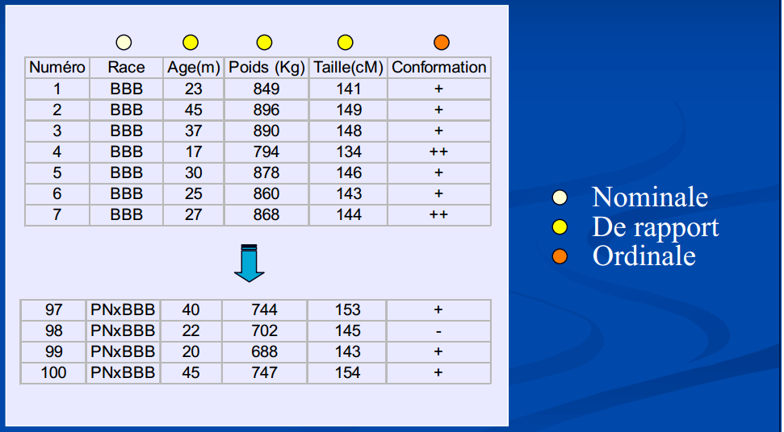

# Biostatistiques, définitions {#chapitre-biostats1}

 ***
️\ **Objectifs spécifiques**:

À la fin de ce chapitre,

- vous serez en mesure de définir les concepts de base en statistique : population, échantillon, variable, probabilité et distribution
- vous serez en mesure de calculer des statistiques descriptives de base : moyenne et écart-type, quartiles, maximum et minimum
- vous comprendrez les notions de test d'hypothèse, d'effet et de p-value, ainsi qu'éviter les erreurs communes dans leur interprétation
- vous saurez effectuer une modélisation statistique linéaire simple, multiple et mixte, entre autre sur des catégories
- vous saurez effectuer une modélisation statistique non linéaire simple, multiple et mixte

 ***

Aux chapitres précédents, nous avons vu comment organiser, manipuler et visualiser des tableaux de données. 

La **statistique** est une collection de disciplines liées à la collecte, l’organisation, l'analyse, l'interprétation et la présentation de données. Les **biostatistiques** sont l'application de ces disciplines à la [*biosphère*](https://fr.wikipedia.org/wiki/Biosph%C3%A8re).

Dans [*Principles and procedures of statistics: A biometrical approach*](https://www.amazon.com/Principles-Procedures-Statistics-Biometrical-Approach/dp/0070610282), **Steel**, **Torie** et **Dickey (1997)** définissent les statistiques ainsi :

> Les **statistiques** forment la science pure et appliquée, de la création, du développement, et de l'application de techniques par lesquelles l'incertitude de l'**induction inférentielle** peut être évaluée. (ma traduction)

Alors que l'**inférence** consiste à généraliser des observations sur des échantillons, à l'ensemble d'une population, l'**induction** est un type de raisonnement qui permet de généraliser des observations en théories. 

> _**Les statistiques** permettent d'évaluer l'incertitude découlant du processus qui permet d'abord de passer de l'échantillon à la population représentée par cet échantillon, puis de passer de cette représentation d'une population en lois générales la concernant_.

La définition de **Whitlock et Schuluter (2015)**, dans [The Analysis of Biological Data](http://whitlockschluter.zoology.ubc.ca/), est plus simple, insistant sur l'**inférence** :

> **La statistique** est l’étude des méthodes pour mesurer des aspects de populations à partir d’échantillons et pour quantifier l'incertitude des mesures. (ma traduction)

**Les statistiques** consistent à *faire du sens* (anglicisme assumé) avec des observations dans l'objectif de répondre à une question que vous aurez formulée clairement, préalablement à votre expérience.

<blockquote class="twitter-tweet" data-lang="fr"><p lang="en" dir="ltr">The more time I spend as The Statistician in the room, the more I think the best skill you can cultivate is the ability to remain calm and repeatedly ask &quot;What question are you trying to answer?&quot;</p>&mdash; Bryan Howie (@bryan_howie) <a href="https://twitter.com/bryan_howie/status/1073054519808876544?ref_src=twsrc%5Etfw">13 décembre 2018</a></blockquote>
<script async src="https://platform.twitter.com/widgets.js" charset="utf-8"></script>

Vous trouverez éventuellement selon la documentation d'autres définitions qui sommes toutes tentent de faire bien comprendre la terminologie :

Statistiques = traitement de variables aléatoires dans les buts de :

- **représentation** (tableaux et graphiques),
- **ajustement** (correction pour la présence d’effets de nuisance),
- **tests d’hypothèse** (ou test statistique) : démarche qui a pour but de fournir une règle de décision permettant, sur la base de résultats d’échantillon, de faire un choix entre deux hypothèses statistiques.
- **prédiction** (valeurs futures). Déterminer de nouvelles valeurs relatives à un modèle mathématique particulier fondé sur l’observation de données d’expérience qui ont conduit à l’élaboration du modèle.

Le flux de travail conventionnel consiste à :

1. collecter des échantillons, 
1. transformer les données, 
1. effectuer des tests, 
1. analyser les résultats, les interpréter et les visualiser. 

Bien que ces tâches soient complexes, en particulier en ce qui a trait aux **tests statistiques**, la plupart des opérations statistiques peuvent être effectuées sans l'assistance de statisticien.ne.s à condition de comprendre suffisamment les concepts utilisés.

Ce chapitre à lui seul est trop court pour permettre d'intégrer toutes les connaissances nécessaires à une utilisation raisonnée des statistiques, mais fourni les bases pour aller plus loin. Notez que les erreurs d'interprétation statistiques sont courantes et la consultation de spécialistes n'est souvent pas un luxe.

Dans ce chapitre, 

- nous verrons comment répondre correctement à une question valide et adéquate avec l'aide d'outils de calcul scientifique. 
- nous couvrirons les notions de bases des distributions et des variables aléatoires qui nous permettront d'effectuer des tests statistiques communs avec **R**
- nous couvrirons aussi les erreurs communément commises en recherche académique et les moyens simples de les éviter.

Ce chapitre est une introduction aux statistiques avec **R**, et ne remplacera pas un bon cours de stats.

En plus des modules de base de **R** nous utiliserons :

* les modules de la **`tidyverse`**,
* le module de données agricoles **`agridat`**, ainsi que 
* le module **`nlme`** spécialisé pour la modélisation mixte. 

Avant de survoler les applications statistiques avec **R**, je vais d'abord et rapidement présenter quelques notions importantes en statistiques : 

- populations et échantillons, 
- variables, 
- probabilités et distributions. 

Nous allons effectuer :

- des tests d'hypothèse univariés 

  - notamment les tests de *t* 
  - et les analyses de variance

- et détailler la notion de p-value. 

Mais avant tout, je vais m'attarder plus longuement aux **modèles linéaires généralisés**, incluant en particulier des effets fixes et aléatoires (_modèles mixtes_), qui fournissent une trousse d'analyse polyvalente en analyse multivariée. Je terminerai avec les perspectives multivariées que sont les __matrices de covariance__ et __de corrélation__.

## Populations et échantillons

Le __principe d'inférence__ consiste à généraliser des conclusions à l'échelle d'une **population** à partir d'**échantillons** issus de cette population. Alors qu'une **population** contient tous les éléments étudiés, un **échantillon** d'une population est une observation unique. 

Une expérience bien conçue fera en sorte que les échantillons soient représentatifs de la population qui, la plupart du temps, ne peut être observée entièrement pour des raisons pratiques.

**Les raisons de l'échantillonnage**

Plutôt que de travailler sur la population, l'échantillon est préféré en ce que :

1. les ressources sont limitées face à une population trop grande (_pêcher toutes les morues atlantiques de la mer est irréalisable_), 

1. les données disponibles sont limitées (_la reproduction des pandas captifs ne peut être étudiée que sur l'effectif captif c'est-à-dire composé d'un nombre restreint d'individus_),

1. l'expérimentation est destructive (_impossible de sacrifier la population belge pour mesurer la longueur de l'intestin_).

Les principes d'expérimentation servant de base à la conception d'une bonne méthodologie sont présentés dans le cours **Dispositifs expérimentaux ou Expérimentation agricole**. Également, je recommande le livre *Principes d'expérimentation : planification des expériences et analyse de leurs résultats* de **Pierre Dagnelie (2012)**, [disponible en ligne en format PDF](http://www.dagnelie.be/docpdf/ex2012.pdf). Un bon aperçu des dispositifs expérimentaux est aussi présenté dans [*Introductory Statistics with R*](https://www.springer.com/us/book/9780387790534), de **Peter Dalgaard (2008)**.

Une population est _échantillonnée_ pour induire des **paramètres** : 

- un rendement typique dans des conditions météorologiques, édaphiques et managériales données,
- la masse typique des faucons pèlerins, mâles et femelles, 
- le microbiome typique d'un sol agricole ou forestier, 
- etc.

Une **statistique** est une estimation d'un paramètre calculée à partir des données, par exemple une moyenne et un écart-type.

Par exemple, la moyenne ($\mu$) et l'écart-type ($\sigma$) d'une population sont estimés par les moyennes ($\bar{x}$) et écarts-types ($s$) calculés sur les données issues de l'échantillonnage.

Chaque __paramètre__ est lié à une perspective que l'on désire connaître chez une population. Ces angles d'observations sont les **variables**.

## Les variables

Nous avons abordé au chapitre \@ref(chapitre-visualisation) la notion de **variable** par l'intermédiaire d'une donnée. 

> Une __variable__ est l'observation d'une caractéristique décrivant un échantillon et qui est susceptible de varier d'un échantillon à un autre. 

Si les observations varient en effet d'un échantillon à un autre, on parlera de __variable aléatoire__. Même le hasard est régi par certaines lois : _ce qui est aléatoire dans une variable peut être décrit par des **lois de probabilité**, que nous verrons plus bas_.

Mais restons aux __variables__ pour l'instant. Par convention, on peut attribuer aux variables un symbole mathématique. Par exemple, on peut donner à la masse volumique d'un sol (_qui est le résultat d'une méthodologie précise_) le symbole $\rho$. Lorsque l'on attribue une valeur à $\rho$, on parle d'une donnée. Chaque donnée d'une observation a un indice qui lui est propre, que l'on désigne souvent par $i$, que l'on place en indice $\rho_i$. Pour la première donnée, on a $i=1$, donc $\rho_1$. Pour un nombre $n$ d'échantillons, on aura $\rho_1$, $\rho_2$, $\rho_3$, ..., $\rho_n$, formant le vecteur $\rho = \left[\rho_1, \rho_2, \rho_3, ..., \rho_n \right]$.

En __R__, une variable est associée à un **vecteur** ou une **colonne** d'un tableau.

```{r}
rho <- c(1.34, 1.52, 1.26, 1.43, 1.39) # matrice 1D
data <- data.frame(rho = rho) # tableau
data
```

Il existe plusieurs types de variables, qui se regroupent en deux grandes catégories : les **variables quantitatives** et les **variables qualitatives**.

### Variables quantitatives

Les valeurs sont mesurées, exemples : poids, taille, pression artérielle, taux de lipide, température, etc.

Ces variables peuvent être :

- __continues__ dans un espace échantillonnal réel. L’espace contient un nombre indénombrable
(*infini*) de valeurs, exemples : poids, taille, pression artérielle, taux de lipide, température, etc.

- ou __discrètes__ dans un espace échantillonnal ne considérant que des valeurs fixes. L’espace contient un nombre dénombrable de valeurs (= “valeurs isolées” de la variable, ensemble fini). **Notez (pour éviter toute confusion) qu'à chaque Race et Conformation on peut attribuer un chiffre !



Notons que la notion de __nombre réel__ est toujours une approximation en sciences expérimentales comme en calcul numérique, étant donnée que l'on est limité par la précision des appareils comme par le nombre d'octets à utiliser bien que les valeurs fixes des distributions discrètes ne soient pas toujours des valeurs entières, c'est bien souvent le cas en biostatistiques comme en démographie, où les décomptes d'individus sont souvent présents (_et où la notion de fraction d'individus n'est pas acceptée_).

### Variables qualitatives

On exprime parfois qu'une __variable qualitative__ est une variable impossible à mesurer numériquement mais sont des appréciations (parfois subjectives) : une couleur, l'appartenance à une espèce ou à une série de sol, sexe, race, état sanitaire, conformation, etc. 



Pourtant, dans bien des cas, les _variables qualitatives_ peuvent être encodées en variables quantitatives. 

> Par exemple, 
>
> on peut accoler des pourcentages de sable, limon et argile à un loam sableux, qui autrement est décrit par la classe texturale d'un sol. 
> 
> Pour une couleur, on peut lui associer des pourcentages de rouge, vert et bleu, ainsi qu'un ton. 
>
> En ce qui a trait aux variables ordonnées, il est possible de supposer un étalement. Par exemple, une variable d'intensité faible-moyenne-forte peut être transformée linéairement en valeurs quantitatives -1, 0 et 1. Attention toutefois, l'étalement peut parfois être quadratique ou logarithmique. 
>
> Les séries de sol peuvent être encodées par la proportion de gleyfication ([Parent et al., 2017](https://www.frontiersin.org/articles/10.3389/fenvs.2017.00081/full#B4)).
>
> Quant aux catégories difficilement transformables en quantités, on pourra passer par l'**encodage catégoriel**, souvent appelé *dummyfication*, qui nous verrons plus loin.

### Niveau ou échelle de mesure

Le niveau ou l'**échelle de mesure** est une classification qui décrit la nature de l'information dans les valeurs attribuées aux variables. Le psychologue [**Stanley Smith Stevens**](https://en.wikipedia.org/wiki/Level_of_measurement) a développé la classification la plus connue avec quatre niveaux ou échelles de mesure : nominale, ordinale, intervalle et rapport.

- Variable __qualitative__ : échelle [ordinale](https://fr.wikipedia.org/wiki/Variable_ordinale) ou [nominale](https://www.ibm.com/support/knowledgecenter/fr/SSLVMB_23.0.0/spss/base/chart_creation_vartypes.html).

  - on qualifie d'ordinale une variable qualitative pour laquelle la valeur mesurée sur chaque individu (parfois qualifiée de catégorie ou de modalité) est numérique. On peut alors classer les individus par valeurs croissantes ou décroissantes (par exemple, des niveaux de satisfaction allant de Très mécontent à Très satisfait, codé par des chiffres ou pas). La moyenne sur plusieurs individus n'a pas toujours de sens mathématiquement, et a peu d'intérêt en pratique. On doit s'intéresser à la médiane. 
  
  - Une variable peut être traitée comme étant nominale si ses valeurs représentent des catégories sans classement intrinsèque (par exemple, le service de la société dans lequel travaille un employé). La région, le code postal ou l'appartenance religieuse sont des exemples de variables nominales.

- Variable __quantitative__ : échelle d’intervalle (référence) ou de rapport (zéro vrai).



Importance de cette classification : le choix des tests statistiques sont basés sur ces  critères de classification.

**Quiz**

```
- Poids, Taille, Pression artérielle : Continues, Quantitatives, échelle de rapport
- Sexe, Race : Discrètes, Qualitatives, échelle nominale
- Etat sanitaire, Conformation : Discrètes, Qualitatives, échelle ordinale
- Comptages (Nombre de mâles par portée, bactéries) : Discrète, Quantitative, échelle de rapport
- Température : Continue, Quantitative, échelle d’intervalle
``` 

## Les probabilités

> « Nous sommes si éloignés de connaître tous les agens de la nature et leurs divers modes d'action, qu'il ne serait pas philosophique de nier les phénomènes, uniquement parce qu'ils sont inexplicables dans l'état actuel de nos connaissances. Seulement, nous devons les examiner avec une attention d'autant plus scrupuleuse, qu'il paraît plus difficile de les admettre ; et c'est ici que le calcul des probabilités devient indispensable, pour déterminer jusqu'à quel point il faut multiplier les observations ou les expériences, afin d'obtenir en faveur des agens qu'elles indiquent, une probabilité supérieure aux raisons que l'on peut avoir d'ailleurs, de ne pas les admettre. » — __Pierre-Simon de Laplace__.

__Une probabilité__ est la vraisemblance qu'un évènement se réalise chez un échantillon. 

Les __probabilités__ forment le cadre des __systèmes stochastiques__, c'est-à-dire des systèmes trop complexes pour en connaître exactement les aboutissants, auxquels on attribue une part de hasard. Ces systèmes sont prédominants dans les processus vivants.

On peut dégager deux perspectives sur les probabilités : l'une passe par une interprétation _fréquentielle_, l'autre _bayésienne_. 

> L'interprétation **fréquentielle** représente **la fréquence des occurrences** après un nombre infini d’évènements. 
>
> Par exemple, si vous jouez à pile ou face un grand nombre de fois, le nombre de pile sera égal à la moitié du nombre de lancés. Il s'agit de l'interprétation communément utilisée.

> L'interprétation **bayésienne** vise à **quantifier l'incertitude** des phénomènes. Dans cette perspective, plus l'information s'accumule, plus l'incertitude diminue. 
>
> Cette approche gagne en notoriété notamment parce qu'elle permet de décrire des phénomènes qui, intrinsèquement, ne peuvent être répétés infiniment (_absence d'asymptote_), comme celles qui sont bien définies dans le temps ou sur des populations limitées.

L'__approche fréquentielle__ teste si les données concordent avec un modèle du réel, tandis que l'__approche bayésienne__ évalue la probabilité que le modèle soit réel. 

Une erreur courante consiste à aborder des __statistiques fréquentielles__ comme des __statistiques bayésiennes__. 

> Par exemple, si l'on désire évaluer la probabilité de l’existence de vie sur Mars, on devra passer par le bayésien, car avec les stats fréquentielles, l'on devra plutôt conclure si les données sont conformes ou non avec l'hypothèse de la vie sur Mars (exemple tirée du blogue [Dynamic Ecology](https://dynamicecology.wordpress.com/2011/10/11/frequentist-vs-bayesian-statistics-resources-to-help-you-choose/)).

Des rivalités factices s'installent enter les tenants des différentes approches, chacune, en réalité, répondant à des questions différentes dont il convient de réfléchir sur les limitations. Bien que les statistiques bayésiennes soient de plus en plus utilisées, nous ne couvrirons dans ce chapitre que l'approche fréquentielle. L'approche bayésienne est néanmoins traitée dans le chapitre \@ref(chapitre-biostats-bayes)-(*voir si à maintenir ici*).

## Les distributions

Une variable aléatoire peut prendre des valeurs selon des __modèles de distribution des probabilités__. 
> _Une __distribution__ est une fonction mathématique décrivant la probabilité d'observer une série d'évènements._

Ces évènements peuvent être 

- des valeurs continues, 
- des nombres entiers, 
- des catégories, 
- des valeurs booléennes (Vrai/Faux), 
- etc. 

Dépendemment du type de valeurs et des observations obtenues, on peut associer les variables à différentes lois de probabilité. Toujours, **l'aire sous la courbe d'une distribution de probabilité est égale à 1**.

En __statistiques inférentielles__, les distributions sont les **modèles**, comprenant certains paramètres comme **la moyenne** et **la variance** pour les **distributions normales**, à partir desquelles les données sont générées.

Il existe deux grandes familles de distributions : **discrètes** et **continues**. 

> Les __distributions discrètes__ sont contraintes à des valeurs prédéfinies (finies ou infinies), c'est-à-dire dont le nombre de résultats possibles est fini ou au plus dénombrable,
> 
> alors que 
> 
> les __distributions continues__ prennent nécessairement un nombre infini de valeurs, dont la probabilité ne peut pas être évaluée ponctuellement, mais sur un intervalle.

L'**espérance mathématique** est une _fonction de tendance centrale_, souvent décrite par un paramètre. Il s'agit de la moyenne d'une population pour une distribution normale. 

La **variance**, quant à elle, décrit la variabilité d'une population, c'est-à-dire son étalement autour de l'espérance. Pour une distribution normale, la variance d'une population est aussi appelée variance, souvent présentée par **l'écart-type**.

### La distribution binomiale

En tant que __scénario à deux issues possibles__, des tirages à pile ou face suivent une loi binomiale, comme toute variable booléenne prenant une valeur vraie ou fausse. 

En biostatistiques, les cas communs sont la présence/absence d'une espèce, d'une maladie, d'un trait phylogénétique, ainsi que les catégories encodées. 

> Lorsque l'opération ne comprend qu'un seul échantillon (_c'est-à-dire un seul tirage à pile ou face_), il s'agit d'un cas particulier d'une loi binomiale que l'on nomme une __loi de Bernouilli__.

Pour 25 tirages à pile ou face indépendants (*c'est-à-dire dont l'ordre des tirages ne compte pas*), on peut dessiner une courbe de distribution dont la somme des probabilités est de **1**. La fonction `dbinom()` est la fonction de distribution de probabilités binomiale. Les fonctions de distribution de probabilités discrètes sont appelées des __fonctions de masse__.

```{r warning = FALSE, message = FALSE}
library("tidyverse")
x <- 0:25
y <- dbinom(x = x, size = 25, prob = 0.5)
print(paste('La somme des probabilités est de', sum(y)))
```

```{r}
ggplot(data = tibble(x, y), mapping = aes(x, y)) +
  geom_segment(aes(x = x, xend = x, y = 0, yend = y), color = "grey50") +
  geom_point()
```

### La distribution de Poisson

La loi de Poisson (avec un P majuscule, introduite par le mathématicien français **Siméon Denis Poisson** et non pas l'animal) décrit des distributions discrètes de probabilité d'un nombre d’évènements se produisant dans l'espace ou dans le temps. 

> Les distributions de Poisson décrivent ce qui tient du décompte. 

Il peut s'agir :

- du nombre de grenouilles traversant une rue quotidiennement, 
- du nombre de plants d'asclépiades se trouvant sur une terre cultivée, 
- du nombre d’évènements de précipitation au mois de juin, 
- etc. 

La distribution de Poisson n'a qu'un seul paramètre, $\lambda$ (*lambda*), qui décrit tant la moyenne des décomptes.

Par exemple, en un mois de 30 jours, et une moyenne de 8 évènements de précipitation pour ce mois, on obtient la distribution suivante.

```{r}
x <- 1:30
y <- dpois(x, lambda = 8)
print(paste('La somme des probabilités est de', sum(y)))
```

```{r}
ggplot(data = data.frame(x, y), mapping = aes(x, y)) +
  geom_segment(aes(x = x, xend = x, y = 0, yend = y), color = "grey50") +
  geom_point()
```

### Distribution uniforme

> Si toute valeur de X est équiprobable dans l’intervalle [a,b], alors X suit une loi uniforme.

La distribution la plus simple est probablement la distribution uniforme. Si la variable est discrète, chaque catégorie est associée à une probabilité égale. Si la variable est continue, la probabilité est directement proportionnelle à la largeur de l'intervalle. 

On utilise rarement la distribution uniforme en biostatistiques, sinon pour décrire des *a priori* vagues pour l'analyse bayésienne (ce sujet est traité dans le chapitre \@ref(chapitre-biostats-bayes) si jamais on le couvre). 

On utilise la fonction `dunif()`. À la différence des distributions discrètes, les fonctions de distribution de probabilités continues sont appelées des fonctions de densité d'une loi de probabilité (*probability density function*).

```{r}
increment <- 0.01
x <- seq(-4, 4, by = increment)
y1 <- dunif(x, min = -3, max = 3)
y2 <- dunif(x, min = -2, max = 2)
y3 <- dunif(x, min = -1, max = 1)

print(paste('La somme des probabilités est de', sum(y1 * increment)))
print(paste('La somme des probabilités est de', sum(y2 * increment)))
print(paste('La somme des probabilités est de', sum(y3 * increment)))
```

```{r}
gg_unif <- data.frame(x, y1, y2, y3) %>% 
  gather(variable, value, -x)

ggplot(data = gg_unif, mapping = aes(x = x, y = value)) +
  geom_line(aes(colour = variable))
```

### Distribution normale

La plus répandue de ces lois est probablement la **loi normale**, parfois nommée **loi gaussienne** et plus rarement **loi laplacienne**. Il s'agit de la distribution classique en forme de cloche.

> La loi normale est décrite par **une moyenne**, qui désigne la tendance centrale, et **une variance**, qui désigne l'étalement des probabilités autour de la moyenne. La racine carrée de la variance est **l'écart-type**.

Les distributions de mesures exclusivement positives (comme le poids ou la taille) sont parfois avantageusement approximées par une loi **log-normale**, qui est une loi normale sur le logarithme des valeurs : la moyenne d'une loi log-normale est la moyenne géométrique.

```{r}
increment <- 0.01
x <- seq(-10, 10, by = increment)
y1 <- dnorm(x, mean = 0, sd = 1)
y2 <- dnorm(x, mean = 0, sd = 2)
y3 <- dnorm(x, mean = 0, sd = 3)

print(paste('La somme des probabilités est de', sum(y1 * increment)))
print(paste('La somme des probabilités est de', sum(y2 * increment)))
print(paste('La somme des probabilités est de', sum(y3 * increment)))
```

```{r}
gg_norm <- data.frame(x, y1, y2, y3) %>% 
  gather(variable, value, -x)

ggplot(data = gg_norm, mapping = aes(x = x, y = value)) +
  geom_line(aes(colour = variable))
```

> Quelle est la probabilité d'obtenir le nombre 0 chez une observation continue distribuée normalement dont la moyenne est 0 et l'écart-type est de 1 ? Réponse : 0. 

La loi normale étant une distribution continue, les probabilités non-nulles ne peuvent être calculés que sur des intervalles. Par exemple, la probabilité de retrouver une valeur dans l'intervalle entre -1 et 2 est calculée en soustrayant la probabilité cumulée à -1 de la probabilité cumulée à 2.

```{r}
increment <- 0.01
x <- seq(-5, 5, by = increment)
y <- dnorm(x, mean = 0, sd = 1)

prob_between <- c(-1, 2)

gg_norm <- data.frame(x, y)
gg_auc <- gg_norm %>%
  filter(x > prob_between[1], x < prob_between[2]) %>%
  rbind(c(prob_between[2], 0)) %>%
  rbind(c(prob_between[1], 0))

ggplot(data.frame(x, y), aes(x, y)) +
  geom_polygon(data = gg_auc, fill = '#71ad50') + # #71ad50 est un code de couleur format hexadécimal
  geom_line()

prob_norm_between <- pnorm(q = prob_between[2], mean = 0, sd = 1) - pnorm(q = prob_between[1], mean = 0, sd = 1)
print(paste("La probabilité d'obtenir un nombre entre", 
            prob_between[1], "et", 
            prob_between[2], "est d'environ", 
            round(prob_norm_between, 2) * 100, "%"))
```

La courbe normale peut être utile pour évaluer la distribution d'une population. 

> Par exemple, on peut calculer les limites de région sur la courbe normale qui contient 95% des valeurs possibles en tranchant 2.5% de part et d'autre de la moyenne. 

Il s'agit ainsi de l'**intervalle de confiance** sur la déviation de la distribution.

```{r}
increment <- 0.01
x <- seq(-5, 5, by = increment)
y <- dnorm(x, mean = 0, sd = 1)

alpha <- 0.05
prob_between <- c(qnorm(p = alpha/2, mean = 0, sd = 1),
                  qnorm(p = 1 - alpha/2, mean = 0, sd = 1))

gg_norm <- data.frame(x, y)

gg_auc <- gg_norm %>%
  filter(x > prob_between[1], x < prob_between[2]) %>%
  rbind(c(prob_between[2], 0)) %>%
  rbind(c(prob_between[1], 0))

ggplot(data = data.frame(x, y), mapping = aes(x, y)) +
  geom_polygon(data = gg_auc, fill = '#71ad50') + # #71ad50 est un code de couleur format hexadécimal
  geom_line() +
  geom_text(data = data.frame(x = prob_between,
                              y = c(0, 0),
                              labels = round(prob_between, 2)),
            mapping = aes(label = labels))
```

On pourrait aussi être intéressé à l'intervalle de confiance sur la moyenne. En effet, la moyenne suit aussi une distribution normale, dont la tendance centrale est la moyenne de la distribution, et dont l'écart-type est noté *erreur standard*. On calcule cette erreur en divisant la variance par le nombre d'observation, ou en divisant l'écart-type par la racine carrée du nombre d'observations. Ainsi, pour 10 échantillons :

```{r}
increment <- 0.01
x <- seq(-5, 5, by = increment)
y <- dnorm(x, mean = 0, sd = 1)

alpha <- 0.05
prob_between <- c(qnorm(p = alpha/2, mean = 0, sd = 1) / sqrt(10),
                  qnorm(p = 1 - alpha/2, mean = 0, sd = 1) / sqrt(10))

gg_norm <- data.frame(x, y)

gg_auc <- gg_norm %>%
  filter(x > prob_between[1], x < prob_between[2]) %>%
  rbind(c(prob_between[2], 0)) %>%
  rbind(c(prob_between[1], 0))

ggplot(data = data.frame(x, y), mapping = aes(x, y)) +
  geom_polygon(data = gg_auc, fill = '#71ad50') + 
  geom_line() +
  geom_text(data = data.frame(x = prob_between,
                              y = c(0, 0),
                              labels = round(prob_between, 2)),
            mapping = aes(label = labels))
```

Il existe plusieurs autres lois de probabilités dont vous trouverez de bonnes bases pour les programmer en R sur ce lien : [Les loi de probabilités, ajustement et test](https://fr.wikibooks.org/wiki/Programmer_en_R/Les_loi_de_probabilit%C3%A9s,_ajustement_et_test).

