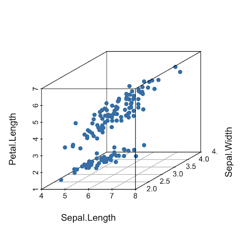
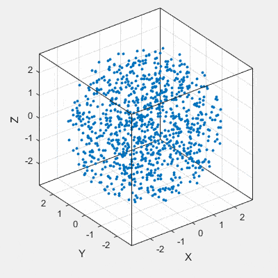
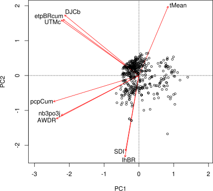

--- 
title: "Biostatistiques"
author: "Z. Coulibali, Agronome, PhD."
date: "`r Sys.Date()`"
site: bookdown::bookdown_site
documentclass: book
#bibliography: [book.bib, packages.bib]
biblio-style: apalike
link-citations: yes
description: "Notes de cours de Biostatistiques"
---

# Introduction {#chapitre-intro}

Placeholder


## Étapes du projet en science des données
## Statistiques ou Science des données ?
## Table des matières

<!--chapter:end:index.Rmd-->


# La science des données avec R {#chapitre-intro-a-R}

Placeholder


## Organiser son environnement de travail en R
## Préparer son flux de travail
### Installation classique de R
### L'interpréteur de commandes RStudio
### R markdown
## Premiers pas avec R
### Types de données
### Les collections de données
#### Les Vecteurs
#### Les Matrices
#### Les Listes
#### Les Tableaux
### Les fonctions
### Les boucles
#### Boucles for
#### Boucles while
### Conditions : if, else if, else
### Installer et charger un module
## Enfin...

<!--chapter:end:02_introar.Rmd-->


# Organisation des données et opérations sur les tableaux {#chapitre-tableaux}

Placeholder


## Les collections de données
## Organiser un tableau de données
## Formats de tableau
### *xls* ou *xlsx*
### *csv*
### *json*
### SQLite
### Suggestion
## Entreposer ses données
## Manipuler des données en mode tidyverse
### Importer les données dans la session de travail
### Comment sélectionner et filtrer des données ?
#### Sélectionner
#### Filtrer
### Le format long et le format large
### Combiner des tableaux
### Opérations sur les tableaux
### Exemple (difficile) - (Extra)
### Exporter un tableau
### Aller plus loin dans le tidyverse
## Références

<!--chapter:end:03_tableaux.Rmd-->


# Visualisation {#chapitre-visualisation}

Placeholder


## Pourquoi explorer graphiquement ?
## Publier un graphique
### Cinq qualités d'un bon graphique
## Choisir le type de graphique le plus approprié
## Choisir son outils de visualisation
### Approche impérative
### Approche déclarative
## Visualisation en R
## Module de base pour les graphiques
## La grammaire graphique ggplot2
## Mon premier ggplot
### Les facettes
### Plusieurs sources de données
### Exporter avec style
### Nuages de points
### Diagrammes en lignes
### Les histogrammes
### Boxplots
### Les diagrammes en barre
### Exporter un graphique
## Les graphiques comme outil d'exploration des données
### Des graphiques interactifs !
### Des extensions de ggplot2
### Aller plus loin avec ggplot2
## Choisir les bonnes couleurs
## Règles particulières
### Ne tronquez pas inutilement l'axe des $y$
### Utilisez un encrage proportionnel
### Publiez vos données
### Visitez `www.junkcharts.typepad.com/` de temps à autre 

<!--chapter:end:04_visualisation.Rmd-->


# Biostatistiques, définitions {#chapitre-biostats1}

Placeholder


## Populations et échantillons
## Les variables
### Variables quantitatives
### Variables qualitatives
### Niveau ou échelle de mesure
## Les probabilités
## Les distributions
### La distribution binomiale
### La distribution de Poisson
### Distribution uniforme
### Distribution normale

<!--chapter:end:05_biostatsdef.Rmd-->


# Statistiques descriptives {#chapitre-statsdesc}

Placeholder


## Sommaire des données
## Moyenne et écart-type
## Quartiles
## Décomptes et proportions
## Tests d'hypothèses à 1 et 2 échantillons
### L'hypothèse nulle
### Test de t à un seul échantillon
### Intervalle de confiance
### La *p-value*
#### Attention aux mauvaises interprétations des *p-values*
#### Attention au *p-hacking*
### Test de Wilcoxon à un seul échantillon
### Tests de t à deux échantillons
### Enregistrer les résultats d'un test
### Comparaison des variances
### Tests de Wilcoxon à deux échantillons
### Les tests pairés
## L'analyse de variance

<!--chapter:end:06_statsdesc.Rmd-->


# Modèles statistiques {#chapitre-modelisation}

Placeholder


## Modèles à effets fixes
### Modèle linéaire univarié avec variable continue
### Analyse des résidus
### Régression multiple
### Modèles linéaires univariés avec variable catégorielle **nominale**
#### L'encodage catégoriel
#### Exemple d'application
### Modèles linéaires univariés avec variable catégorielle **ordinale**
### Régression multiple à plusieurs variables
### Les modèles linéaires généralisés
### Les modèles non-linéaires
## Modèles à effets mixtes
### Modèles mixtes non-linéaires
## Aller plus loin
### Statistiques générales
### Statistiques avec R

<!--chapter:end:07_modelstats.Rmd-->


# Association {#chapitre-association}

Placeholder


## Espaces d'analyse
### Abondance et occurence
### Environnement
## Analyse d'association
### Association entre objets (mode Q)
#### Objets: Abondance
#### Objets: Occurence (présence-absence)
#### Objets: Données quantitatives
#### Objets: Données mixtes
### Associations entre variables (mode R)
#### Variables: Abondance
#### Variables: Occurence
#### Variables: Quantités
### Conclusion sur les associations

<!--chapter:end:08_association.Rmd-->

---
title: "Écologie numérique: Ordination"
author: "Serge-Étienne Parent"
date: "`r format(Sys.Date())`"
output: github_document
---

# Analyse statistique multivariée {#chapitre-anastatmv}

## Introduction

Les méthodes multivariées constituent un ensemble d’outils statistiques permettant aux utilisateurs de tirer le maximum d’information contenu dans les tableaux à plusieurs variables. Dans l’étude avec plusieurs unités d’échantillonnage et plusieurs variables (ex. abondance de plusieurs espèces dans plusieurs placeaux, plusieurs descripteurs quantitatifs et/ou qualitatifs mesurés sur plusieurs graines/fruits/arbres, etc.), l’apport des méthodes statistiques multivariées est déterminant. Elles visent à structurer et simplifier les données issues de plusieurs variables, sans privilégier l'une d'entre elles en particulier.

Le choix d’une méthode dépend de l’objectif initial, des types de variables manipulées mais aussi, de la forme des résultats à obtenir. Il existe différents groupes de méthodes multivariées. Nous présentons ici, les méthodes d’ordination (ce chapitre) et les méthodes de classification (chapitre suivant) qui font partie des méthodes multivariées couramment utilisées.

En **écologie**, **biologie**, **agronommie** comme en **foresterie**, la plupart des tableaux de données comprennent de nombreuses variables : pH, teneurs en nutriments (N, P, K, Mg, Ca, ...), variables du climat (pluviométrie, température, SDI, ...), espèces ou cultivars et leurs paramètres végétatifs et de rendements, topographie, etc. 

L'**ordination** vise à mettre de l'ordre dans de telles données dont le nombre élevé de variables peut amener à des difficultés d'appréciation et d'interprétaion ([**Legendre et Legendre, 2012**](https://www.elsevier.com/books/numerical-ecology/legendre/978-0-444-53868-0)). 

<div class="alert alert-block alert-success">**💾** Explicitement, le terme __ordination__ est utilisé en écologie pour désigner les techniques de réduction d'axe. Ces techniques permettent de dégager l'information la plus importante en projetant une synthèse des relations entre les **observations** et entre les **variables**. Certaines techniques ne supposant aucune structure *a priori* sont dites **non-contraignantes** : elles ne comprennent pas de tests statistiques. À l'inverse, les **ordinations contraignantes** lient des variables descriptives avec une ou plusieurs variables prédictives. La référence en la matière est indiscutablement le livre **"Numerical Ecology"** de [**Legendre et Legendre  (2012)**](https://www.elsevier.com/books/numerical-ecology/legendre/978-0-444-53868-0).</div>

L'**analyse en composantes principales** est probablement la plus connue de ces techniques. Mais de nombreuses autres techniques ont été développées au cours des dernières années, chacune ayant ses domaines d'application. Cette section en couvrira quelques unes et vous guidera vers la technique la plus appropriée pour vos données.

***
️\ **Objectifs spécifiques**:

À la fin de ce chapitre, vous serez en mesure d'effectuer des calculs d'__ordination__ à l'aide des techniques communes de __réduction d'axes__ entre autres :

- l'Analyse en Composantes Principales (ACP) - Principal Components Analysis (PCA), 
- l'Analyse de Correspondance (AC) - Correspondence Analysis (CA), encore AFC avec variantes AFCS, AFCM ?
- l'Analyse en Coordonnées Principales (ACoP) - Principal Coordinates Analysis (PCoA), variante du PoMd,
- l'Analyse Discriminante Linéaire (ADL) - Linear Discriminant Analysis (LDA), 
- l'Analyse de Redondance (RDA) - Redundancy Analysis (RDA), et 
- l'Analyse canonique des correspondances (ACC) - Canonical Correspondence Analysis (CCA), variante AC sous contrainte ?

***

## Ordination non contraignante

Cette section couvrira :

- l'**analyse en composantes principales** (ACP), 
- l'**analyse de correspondance** (AC), 
- l'**analyse factorielle** (AF), ainsi que 
- l'**analyse en coordonnées principales** (ACoP).

| Méthode | Distance préservée | Variables (type de données) |
|---|---|---|
| Analyse en composantes principales (ACP) | Distance euclidienne | Données quantitatives, relations linéaires (attention aux double-zéros) |
| Analyse de correspondance (AC) | Distance de $\chi^2$ | Données non-négatives, dimensionnellement homogènes ou binaires, abondance ou occurence |
| Positionnement multidimensionnel (PoMd) | Toute mesure de dissimilarité | Données quantitatives, qualitatives nominales/ordinales ou mixtes |

Source: Adapté de ([Legendre et Legendre, 2012](https://www.elsevier.com/books/numerical-ecology/legendre/978-0-444-53868-0), chapitre 9)

### Analyse en composantes principales

#### Description

L'objectif d'une ACP est de représenter les données dans un nombre réduit de dimensions représentant le plus possible la variation d'un tableau de données : elle permet de projetter les données dans un espace où les variables sont combinées en axes orthogonaux dont le premier axe capte le maximum de variance. L'ACP peut par exemple être utilisée pour analyser des corrélations entre variables ou dégager l'information la plus pertinente d'un tableau de données météo ou de signal en un nombre plus retreint de variables.

<div class="alert alert-block alert-success">**💾** L'ACP effectue une rotation des axes à partir du centre (moyenne) du nuage de points effectuée de manière à ce que le premier axe définisse la direction où l'on retrouve la variance maximale. Ce premier axe est une combinaison linéaire des variables et forme la première composante principale. Une fois cet axe définit, on trouve le deuxième axe, orthogonal au premier, où l'on retouve la variance maximale - cet axe forme la deuxième composante principale, et ainsi de suite jusqu'à ce que le nombre d'axe corresponde au nombre de variables.</div> 

Conceptuellement, toutes les colonnes d'un jeu de données contiennent de l'information potentiellement interessante. L'ACP crée un jeu de données artificiel avec un nombre de dimensions égal à celui du premier. La seule différence est que ses premières dimensions concentrent la majeure partie de l'information. Dans le monde de l'ACP, l'information est appelée inertie. Les dimensions sont appelées facteurs ou axes principaux.

  - Les projections des **observations** sur ces axes principaux sont appelés les **scores** ou **valeurs propres** (*eigenvalues*). 

  - Les projections des **variables** sur les axes principaux sont les **vecteurs propres**  (*eigenvectors*, ou *loadings*). 

  - La variance des composantes principales diminue de la première à la dernière, et peut être calculée comme une proportion de la variance totale : c'est le **pourcentage d'inertie**. 

  - Par convention, on utilise les **valeurs propres** (*eigenvalues*) pour mesurer l'importance des axes. 

  - Si la première composante principale a une inertie de 50% et la deuxième une intertie de 30%, la représentation en $2D$ des projections représentera 80% de la variance du nuage de points. L'information perdue est donc de 20% sur les dimensions initiales réduites à 2 dimensions.

L'**hétérogénéité des échelles de mesure** peut avoir une grande importance sur les résultats d'une ACP (_les données doivent être dimensionnellement homogènes_). En effet, la hauteur d'un *...cériser...* aura une variance plus grande que le diamètre d'une *...cérise...* exprimé dans les mêmes unités, et cette dernière aura plus de variance que la teneur en cuivre d'une feuille. 

  - Il est conséquemment avisé de mettre les données à l'échelle en centrant la moyenne à $0$ et l'écart-type à $1$ avant de procéder à une ACP. L'ACP a été conçue pour projetter en un nombre moindre de dimensions des observations dont les **distributions** sont **multinormales**. Bien que l'ACP soit une technique robuste, il est préférable de transformer préalablement les variables dont la distribution est particulièrement asymétriques ([Legendre et Legendre, 2012, p. 450](https://www.elsevier.com/books/numerical-ecology/legendre/978-0-444-53868-0)). 
  
Le cas échéant, les valeurs extrêmes pourraient faire dévier les vecteurs propres et biaiser l'analyse. En particulier, les ACP menées sur des données compositionnelles sont réputées pour générer des analyses biaisées ([Pawlowsky-Glahn and Egozcue, 2006](http://sp.lyellcollection.org/content/specpubgsl/264/1/1.full.pdf)). 

<div class="alert alert-block alert-success">**💾** Le **test de Mardia** ([Korkmaz, 2014](https://journal.r-project.org/archive/2014-2/korkmaz-goksuluk-zararsiz.pdf)) peut être utilisé pour tester la multinormalité.</div> 

  - Une distribution multinormale devrait générer des scores en forme d'hypersphère (en forme de cercle sur un biplot : voir plus loin).

#### Vecteurs propres et valeurs propres

<div class="alert alert-block alert-success">**💾** L'algorithme de l'**ACP** effectue sur la matrice individus/variables, différentes opérations, 

- centrage-réduction des données, 
- diagonalisation de la matrice de corrélation, 
- extraction de valeurs propres et de vecteurs propres, 
- etc.

en vue de passer du nombre de variables initiales à un nombre réduit de variables obtenues par combinaison linéaire des premières :les composantes principales ([Kakai et al., 2016](https://www.researchgate.net/publication/301214230_Methodes_statistiques_multivariees_utilisees_en_ecologie)).</div>

Une matrice carrée (comme une matrice de covariance, appelée $\Sigma$) multipliée par un vecteur propre ($e$) est égale aux valeurs propres ($\lambda$) multipliées par les vecteurs propres ($e$).

$$ \Sigma e = \lambda e $$

De manière intuitive,

  - les **vecteurs propres** indiquent l'orientation de la covariance, et 
  - les **valeurs propres** indiquent la longueur associée à cette direction. 
  - L'ACP est basée sur le calcul des vecteurs propres et des valeurs propres de la matrice de covariance des variables. 

Pour d'abord obtenir les valeurs propres ($\lambda$), il faut résoudre l'équation

$$ det(cov(X) - \lambda I) = 0 $$ 

où 

  - $det()$ est l'opération permettant de calculer le déterminant, 
  - $cov()$ est l'opération pour calculer la covariance, 
  - $X$ est la matrice de données (le dataframe), 
  - les $\lambda$ sont les valeurs propres et 
  - $I$ est une matrice d'identité.

Pour $p$ variables dans votre tableau $X$, vous obtiendrez $p$ valeurs propres. Ensuite, on trouve les vecteurs propres en résolvant l'équation $ \Sigma e = \lambda e $.

Bien qu'il soit possible d'[effectuer cette opération à la main](https://www.youtube.com/watch?v=2fCBE7DWgd0&list=PLBv09BD7ez_5_yapAg86Od6JeeypkS4YM) pour des cas très simples, vous aurez avantage à utiliser un langage de programmation.

Chargeons les données d'iris, puis isolons seulement les deux dimensions des sépales de l'espèce *setosa*.

```{r}
library("tidyverse")
data("iris")
setosa_sepal <- iris %>% 
  filter(Species == "setosa") %>% 
  select(starts_with("Sepal")) %>% 
  rename(
    long_sepal = Sepal.Length,
    larg_sepal = Sepal.Width)
setosa_sepal
```

Test de multinormalité de Mardia :

```{r}
library("MVN")
setosa_sepal_mvn <- mvn(setosa_sepal, mvnTest = "mardia")
setosa_sepal_mvn$multivariateNormality
```

**H0 du test** : La distribution n'est pas multinormale.

<div class="alert alert-block alert-success">**💾** Pour considérer la distribution comme multinormale, les **p-value** de la distortion (`Mardia Skewness`) **et** de la statistique de Kurtosis (`Mardia Kurtosis`) doivent être égales ou plus élevées que $0.05$ ([Kormaz, 2019, fiche d'aide de la fonction `mvn` de R](https://www.rdocumentation.org/packages/MVN/versions/5.6/topics/mvn)).</div>

C'est bien le cas pour les données du tableau `setosa_sepal`.

Pour des petits jeux de données, on pourra faire certains calculs à la main. L'idée majeure dans ce cas est de savoir techniquement comment ça se fait. Pour rappels les calculs à la mitaine :

  - de la moyenne, 

$$
\bar{x} = \frac{1}{N} \sum_{i=1}^{n} n_{i} x_{i}
$$

  - de la variance, 

$$
Var(X) =\frac{1}{N} \sum_{i=1}^{n} n_{i}\left(\bar{x}-x_{i}\right)^{2}
$$

  - de l'écart-type, 

$$
\sigma_{X}=\sqrt{\operatorname{Var}(x)}
$$

  - de la covariance, avec une 2nde formule de calcule plus pratique 

$$
\operatorname{Cov}(X, Y)=\frac{1}{N} \sum\left(x_{i}-\mu(X)\right) \times\left(y_{i}-\mu(Y)\right)
$$

$$
\operatorname{Cov}(X, Y)=\left(\frac{1}{N} \sum x_{i} y_{i}\right)-\mu(X) \times \mu(Y)
$$

  - du coefficient de corrélation

$$
\operatorname{Corr}(X, Y)=\frac{\operatorname{Cov}(X, Y)}{\sigma(X) \sigma(Y)}
$$

Mais profitons du génie logiciel avec R. Retirons de la matrice de covariance, les valeurs et vecteurs propres avec la fonction `eigen` du package `base`.

```{r}
setosa_eigen <- eigen(cov(setosa_sepal))

setosa_eigenval <- setosa_eigen$values
setosa_eigenval
```

```{r}
setosa_eigenvec <- setosa_eigen$vectors
setosa_eigenvec
```

Le premier vecteur propre correspond à la première colonne, et le second à la deuxième. Les coordonnées $x$ et $y$ sont les premières et deuxièmes lignes.

Les **vecteurs propres** ont une longueur unitaire (norme de 1). Ils peuvent être mis à l'échelle à la racine carrée des valeurs propres.

```{r}
setosa_eigenvec_sc <- setosa_eigenvec %*% diag(sqrt(setosa_eigen$values))
setosa_eigenvec_sc
```

Un aperçu de la racine carrée des valeurs propres en matrice diagonale :

```{r}
diag(sqrt(setosa_eigen$values))
```

Pour effectuer la translation des vecteurs propres au centre du nuage de point, nous avons besoin du centroïde.

```{r}
centroid <- setosa_sepal %>% apply(., 2, mean)
centroid
```

Aperçu graphique :

  - Le nuage de points

```{r}
plot(setosa_sepal, asp = 1) # asp, the y/x aspect ratio
```

  - Ajout des vecteurs propres brutes en couleur verte :
  
```{r}
plot(setosa_sepal, asp = 1) # asp, the y/x aspect ratio
# vecteurs propres brutes
lines(x = c(centroid[1], centroid[1] + setosa_eigenvec[1, 1]),
      y = c(centroid[2], centroid[2] + setosa_eigenvec[2, 1]), col = "green", lwd = 3) # vecteur propre 1
lines(x=c(centroid[1], centroid[1] + setosa_eigenvec[1, 2]),
      y=c(centroid[2], centroid[2] + setosa_eigenvec[2, 2]), col = "green", lwd = 3) # vecteur propre 2
```

  - Ajout des vecteurs propres à l'échelle en couleur rouge :

```{r}
plot(setosa_sepal, asp = 1) # asp, the y/x aspect ratio
# vecteurs propres brutes
lines(x = c(centroid[1], centroid[1] + setosa_eigenvec[1, 1]),
      y = c(centroid[2], centroid[2] + setosa_eigenvec[2, 1]), 
      col = "green", lwd = 3) # vecteur propre 1
lines(x=c(centroid[1], centroid[1] + setosa_eigenvec[1, 2]),
      y=c(centroid[2], centroid[2] + setosa_eigenvec[2, 2]), 
      col = "green", lwd = 3) # vecteur propre 2
# vecteurs propres à l'échelle
lines(x = c(centroid[1], centroid[1] + setosa_eigenvec_sc[1, 1]),
      y = c(centroid[2], centroid[2] + setosa_eigenvec_sc[2, 1]), 
      col = "red", lwd = 4) # vecteur propre 1
lines(x = c(centroid[1], centroid[1] + setosa_eigenvec_sc[1, 2]),
      y = c(centroid[2], centroid[2] + setosa_eigenvec_sc[2, 2]), 
      col = "red", lwd = 4) # vecteur propre 2
```

  - Ajout du centroid, le point bleu :

```{r}
plot(setosa_sepal, asp = 1) # asp, the y/x aspect ratio
# vecteurs propres brutes
lines(x = c(centroid[1], centroid[1] + setosa_eigenvec[1, 1]),
      y = c(centroid[2], centroid[2] + setosa_eigenvec[2, 1]), 
      col = "green", lwd = 3) # vecteur propre 1
lines(x=c(centroid[1], centroid[1] + setosa_eigenvec[1, 2]),
      y=c(centroid[2], centroid[2] + setosa_eigenvec[2, 2]), 
      col = "green", lwd = 3) # vecteur propre 2
# vecteurs propres à l'échelle
lines(x = c(centroid[1], centroid[1] + setosa_eigenvec_sc[1, 1]),
      y = c(centroid[2], centroid[2] + setosa_eigenvec_sc[2, 1]), 
      col = "red", lwd = 4) # vecteur propre 1
lines(x = c(centroid[1], centroid[1] + setosa_eigenvec_sc[1, 2]),
      y = c(centroid[2], centroid[2] + setosa_eigenvec_sc[2, 2]), 
      col = "red", lwd = 4) # vecteur propre 2

points(x = centroid[1], y = centroid[2], pch = 16, cex = 2, col = "blue") # centroid
```

On peut observer que, comme mentionné plus haut, **les vecteurs propres indiquent l'orientation de la covariance, et les valeurs propres indiquent la longueur associée à cette direction**.

#### Biplot de l'ACP

Imaginez un nuage de points en $3D$, axe $y$ compris. 



Vous tournez votre nuage de points pour trouver la perspective en $2D$ qui fera en sorte que vos données soient les plus dispersées possibles, voir présentation grossière :



[Nuage de points en 3 dimensions](https://www.google.com/url?sa=i&url=https%3A%2F%2Fnumerisation3d.construction%2Fnuages-de-points-meshs%2F&psig=AOvVaw1k5OLYTl_sNuvM5HSuuWio&ust=1620994315147000&source=images&cd=vfe&ved=0CAIQjRxqFwoTCOjkz8rQxvACFQAAAAAdAAAAABAE)

Lorsque la perspective est trouvée, avec une lampe de poche, vous illuminez votre nuage de points dans l'axe de cette perspective : vous venez d'effectuer une analyse en composantes principales, et **l'ombre des points et des axes sur le mur formera votre biplot**.

Pour créer un biplot, on juxtapose :

  - les **descripteurs** (les variables) en tant que vecteurs propres, représentés par des flèches,

  - et les **objets** (les observations) en tant que scores (valeurs propres), représentés par des points. 

Les résultats d'une ordination peuvent être présentés selon deux types de biplots ou de projections ([Legendre et Legendre, 2012](https://www.elsevier.com/books/numerical-ecology/legendre/978-0-444-53868-0)) courramment utilisés :

<div class="alert alert-block alert-success">**💾** **Les Biplots de distance**

Ce type de projection permet de visualiser la position des **objets** (observations) entre eux et par rapport aux **descripteurs** (variables) et d'apprécier la contribution des descripteurs pour créer les composantes principales.</div> 

Pour créer un biplot de distance, on projette directement les vecteurs propres ($U$) en guise de descripteurs. Pour ce qui est des objets, on utilise les scores de l'ACP ($F$). De cette manière, 

1. les distances euclidiennes entre les scores sont des approximations des distances euclidiennes dans l'espace multidimentionnel,

2. la projection d'un objet sur un descripteur perpendiculairement à ce dernier est une approximation de la position de l'objet sur le descripteur et

3. la projection d'un descripteur sur un axe principal est proportionnelle à sa contribution pour générer l'axe.

<div class="alert alert-block alert-success">**💾** **Les Biplots de corrélation** 

Cette projection permet d'apprécier les corrélations entre les descripteurs.</div> 

Pour ce faire, 

  - les objets et les valeurs propres doivent être transformés.

  - Pour générer les descripteurs, les vecteurs propres ($U$) doivent être multipliés par la matrice diagonalisée de la racine carrée des valeurs propres ($\Lambda$), c'est-à-dire $U \Lambda ^{\frac{1}{2}}$. 

  - En ce qui a trait aux objets, on multiplie les scores ($F$) par la racine carrée négative des valeurs propres diagonalisées, c'est-à-dire $F \Lambda ^{- \frac{1}{2}}$. 

De cette manière, 

1. tout comme c'est le cas pour le biplot de distance, la projection d'un objet sur un descripteur perpendiculairement à ce dernier est une approximation de la position de l'objet sur le descripteur,

2. la projection d'un descripteur sur un axe principal est proportionnelle à son écart-type et

3. les **angles** entre les descripteurs sont proportionnels à leur corrélation (et non pas leur proximité).

<div class="alert alert-block alert-success">**💾** En d'autres mots, le biplot de distances devrait être utilisé pour apprécier la distance entre les objets et le biplot de corrélation devrait être utilisé pour apprécier les corrélations entre les descripteurs.</div>

Mais dans tous les cas, **le type de biplot utilisé doit être indiqué**.



<center>**Biplot de corrélation** permettant de visualiser les corrélations entre des variables météorologiques. Source: [Parent, 2017]()</center>

<div class="alert alert-block alert-success">**💾** Le *triplot* est une forme apparentée au **biplot**, auquel on ajoute des variables prédictives. Le triplot est utile pour représenter les résultats des ordinations contraignantes comme les analyses de redondance et les analyse de correspondance canoniques.</div>

#### Application

Bien que l'ACP puisse être effectuée grâce à des modules de base de R, nous utiliserons le module `vegan`. Le tableau [`varechem`](https://rdrr.io/rforge/vegan/man/varechem.html) comprend des données issues d'analyse de sols identifiés par leur composition chimique, leur pH, leur profondeur totale et la profondeur de l'humus publiées dans [Väre et al. (1995)](http://onlinelibrary.wiley.com/doi/10.2307/3236351/abstract) et exportées du module [vegan](https://rdrr.io/rforge/vegan/).

```{r}
library("vegan")
data("varechem")
varechem %>% 
  sample_n(5)
```

Comme nous l'avons vu précdemment, les données de concentration sont de type *compositionnelles*. Les données compositionnelles du tableau `varechem` mériteraient d'être transformées ([Aitchison et Greenacre, 2002](http://doi.wiley.com/10.1111/1467-9876.00275)). Utilisons les log-ratios centrés (*clr*).

```{r}
library("compositions")

varecomp <- varechem %>%
  select(-Baresoil, -Humdepth, -pH) %>% 
  mutate(Fv = apply(., 1, function(x) 1e6 - sum(x)))

vareclr <- varecomp %>%
  acomp(.) %>%
  clr(.) %>% 
  as_tibble() %>% 
  bind_cols(varechem %>%
              select(Baresoil, Humdepth, pH))
vareclr %>% 
  sample_n(5)
```

Effectuons l'**ACP**. Pour cet exemple, nous standardiserons les données étant données que les colonnes `Baresoil`, `Humedepth` et `pH` ne sont pas à la même échelle que les colonnes des **clr**.

```{r}
vareclr_sc <- scale(vareclr)
vare_pca <- rda(vareclr_sc) 
# ou bien rda(vareclr, scale = TRUE, mais la mise à l'échelle préalable est plus explicite)
```

L'objet `vareclr_pca` contient l'information nécessaire pour mener notre ACP.

```{r}
summary(vare_pca, scaling = 2) 
# scaling = 2 pour obtenir les infos pour les biplots de corrélation
```

La deuxième ligne de `Importance of components`, `Proportion Explained`, indique la proportion de la variance totale captée successivement par les axes principaux. Le premier axe principal comporte 47.68% de la variance. Le deuxième axe principal ajoutant une proportion de 16,51%, une représentation en deux axes principaux présentent 64.19 % de la variance.

```{r}
prop_expl <- vare_pca$CA$eig / sum(vare_pca$CA$eig)
prop_expl
```

<div class="alert alert-block alert-success">**💾** La décision du nombre d'axes principaux à retenir est arbitraire.</div>

  - Elle peut dépendre d'un nombre maximal de paramètres à retenir pour éviter de surdimensionner un modèle (*curse of dimensionality*, section 11),

  - ou d'un seuil de pourcentage de variance minimale à retenir, par exemple 75%,

  - ou bien, vous retiendrez deux composantes principales si vous désirez présenter un seul biplot. 

<div class="alert alert-block alert-success">**💾** L'approche de *Kaiser-Guttmann* ([Borcard et al., 2011](http://www.springer.com/us/book/9781441979759)) consiste à sélectionner les composantes principales dont la valeur propre est supérieure à leur moyenne.</div>

```{r}
plot(x = 1:length(vare_pca$CA$eig),
     y = vare_pca$CA$eig,
     type = "b",
     xlab = "Rang de la valeur propre",
     ylab = "Valeur propre")
abline(h = mean(vare_pca$CA$eig), col = "red", lty = 2)
```

<div class="alert alert-block alert-success">**💾** L'approche du *broken stick* consiste à couper un bâton d'une longueur de 1 en n tranches.</div>

  - La première tranche est de longueur $\frac{1}{n}$. 

  - La tranche suivante est d'une longueur de la tranche précédente à laquelle on aditionne  $\frac{1}{longueur~restante}$. 

  - Puis on place les longueurs en ordre décroissant. 

  - On retient les composantes principales dont les valeurs propres cumulées sont plus grandes que le broken stick.

```{r}
broken_stick <- function(x) {
  bsm <- vector("numeric", length = x) # broken-stick method bsm, créé.
  bsm[1] <- 1/x
  for (i in 2:x) {
    bsm[i] <- bsm[i-1] + 1/(x+1-i)
  }
  bsm <- rev(bsm/x)
  return(bsm)
}

```

Le graphique du *broken stick* :

```{r}
plot(x = 1:length(vare_pca$CA$eig),
     y = prop_expl,
     type = "b",
     xlab = "Rang de la valeur propre",
     ylab = "Valeur propre")
lines(x = 1:length(vare_pca$CA$eig),
      y = broken_stick(length(vare_pca$CA$eig)),
      col = "red",
      lty = 2)
```

Les approches *Kaiser-Guttmann* et *broken stick* suggèrent que les trois premières composantes sont suffisantes pour décrire la dispersion des données.

<div class="alert alert-block alert-success">**💾** Généralement, on estime qu’une concentration d’information de 50 % du tableau de départ est suffisante pour garantir une précision d’analyse et sert de critère de choix du nombre de composantes principales à retenir ([Kakai et al., 2016](https://www.researchgate.net/publication/301214230_Methodes_statistiques_multivariees_utilisees_en_ecologie)).</div>

Examinons les loadings (vecteurs propres) plus en particulier. Dans le langage du module `vegan`, les vecteurs propres sont les espèces (`species`) et les scores sont les `sites`.

```{r}
vare_eigenvec <- vegan::scores(vare_pca, scaling = 2, display = "species", 
                               choices = 1:(ncol(vareclr)-1))
vare_eigenvec
```

- L'ordre d'importance des vecteurs propres est établi en ordre croissant des élément des vecteurs propres associées. 

- Un vecteur propre est une combinaison linéaire des variables. Par exemple, 

  - le premier vecteur propre pointe surtout dans la direction du Fe (-1.497) et de l'Al (-1.463). 
  - Le deuxième pointe surtout vers le Mo (2.145). 

- Les vecteurs (*loadings*) d'un biplot de distance présentant les deux premières composantes principales prendront les coordonnées des deux premières colonnes.

  - Le vecteur **Al** aura la coordonnée [-1.463 ; -0.601], 
  - le vecteur de **Fe** sera placé à [-1.497 ; -0.606] 
  - et le vecteur **Mo** à [-0.312 ; 2.145]. 

Il existe différentes fonctions d'affichage des biplots. Notez que leur longueur peut être magnifiée pour améliorer la visualisation.

Lançons la fonction `biplot` pour créer un biplot de distance et un autre de corrélation.

```{r}
par(mfrow = c(1, 2))
biplot(vare_pca, scaling = 1, main = "Biplot de distance")
biplot(vare_pca, scaling = 2, main = "Biplot de corrélation")
```

Le biplot de distance permet de dégager les variables qui expliquent davantage la variabilité dans notre tableau : 

  - les clr du **Fe** et de l'**Al** forment en grande partie le premier axe principal, alors que le clr du **Mo** forme en grande partie le second axe. 

Le biplot de corrélation montre que les clr du **Fe** et du **Al** sont corrélés dans le même sens, mais dans le sens contraire du clr du **Mn**. L'information sur la teneur en **Fe** et celle de l'**Al** est en grande partie redondante. Toutefois, le clr du **Mo** est presque indépendant du clr du **Fe**, ceux-ci étant à angle presque droit (~90°). Ces relations peuvent être explorées directement.

```{r}
par(mfrow = c(1, 2))
plot(vareclr$Al, vareclr$Fe)
plot(vareclr$Mo, vareclr$Fe)
```

Nous avons mentionné que l'**ACP** est une rotation. Prenons un second exemple pour bien en saisir les tenants et aboutissants. Le tableau de données que nous chargerons provient d'une infographie d'un dauphin, intitullée *Bottlenose Dolphin*, conçu par l'artiste [Tarnyloo](https://www.blendswap.com/blends/view/83681). Les points correspondent à la surface d'un dauphin. J'ai ajouté une colonne `anatomy`, qui indique à quelle partie anatomique le point appartient.

```{r}
dolphin <- read_csv("data/dolphin.csv")
dolphin %>% sample_n(5)
```

Voici en vue isométrique ce en quoi consiste ce nuage de points.

```{r}
library("scatterplot3d")
scatterplot3d(x = dolphin$x, y = dolphin$y, z = dolphin$z, pch = 16, cex.symbols = 0.2)
```

Effectuons l'**ACP** sur le dauphin.

```{r}
dolph_pca <- rda(dolphin %>% select(x, y, z), scale = FALSE)
biplot(dolph_pca, scaling = 2)
```

On n'y voit pas grand chose, mais si l'on extrait les scores et que l'on raccourcit les vecteurs :

```{r}
dolph_scores <- vegan::scores(dolph_pca, display = "sites")
dolph_loads <- vegan::scores(dolph_pca, display = "species")
dolph_loads

plot(dolph_scores, pch = 16, cex = 0.24, asp = 1, col = factor(dolphin$anatomy))
segments(x0 = rep(0, 3), y0 = rep(0, 3),
         x = dolph_loads[, 1]/50,
         y = dolph_loads[, 2]/50,
         col = "chocolate", lwd = 4)
```

La meilleure représentation du dauphin en $2D$, selon la variance, est son profil - en effet, il est plus long et haut que large.

<div class="alert alert-block alert-info">**Note**. Une **ACP** effectue seulement une rotation des points. Les distances euclidiennes entre les points sont maintenues.</div>

<div class="alert alert-block alert-info">**Note**. L'**ACP** a été conçue pour projetter en un nombre moindre de dimensions des observations dont les distributions sont multinormales (ce n'est évidemment pas le cas du dauphin).</div>

<div class="alert alert-block alert-info">**Note**. Les axes principaux d'une **ACP** sont des variables aléatoires. Elles peuvent être assujetties à des tests ststistiques, des modèles, du partitionnement de données, etc.</div>

<div class="alert alert-block alert-success">**Excercice**. Effectuez maintenant une **ACP** avec les données d'iris.</div>

### Analyse de correspondance (AC), encore AFC ?

#### Description

Le but de la méthode est aussi de résumer l’information contenue dans un tableau à plusieurs variables, mais en décrivant les relations entre les éléments-lignes (individus) et les éléments-colonnes (variables). Ainsi, l’**AFC** est une sorte de double **ACP** en ce sens qu’elle s’intéresse à la fois aux lignes et aux colonnes du tableau. 

<div class="alert alert-block alert-success">Le tableau sur lequel s’applique l’**AFC** est un tableau de contingence, c’est-à-dire un tableau à double entrée avec des valeurs de comptage ou de fréquence absolues (**données d'abondance et d'occurence**) dans les cellules (Glèlè Kakai et al., 2016).</div>

Tout comme l'**ACP**, les données apportées vers une **AC** doivent être dimensionnellement homogènes, c'est-à-dire que chaque variable doit être de même métrique :

<div class="alert alert-block alert-success">**💾** Pour des données d'abondance, cela signifie que les décomptes réfèrent tous au même concept : individus, colonies, surfaces occupées, etc.</div>

<div class="alert alert-block alert-success">**💾** Alors que la distance euclidienne est préservée avec l'**ACP**, l'**AC** préserve la distance du $\chi^2$, qui est insensible aux double-zéros.</div>

<div class="alert alert-block alert-success">**💾** L'**AC** produit $min(n,p)-1$ axes principaux orthogonaux qui captent non pas le maximum de variance, mais la proportion de mesures aux carré par rapport à la somme des carrés de la matrice.</div>

Le biplot obtenu peut être présenté sous forme :

- de biplot de site `scaling 1`, où la distance du $\chi^2$ est préservée entre les sites 

- ou de biplot d'espèces `scaling 2`, où la distance du $\chi^2$ est préservée entre les espèces. 

<div class="alert alert-block alert-success">**💾** L'**AC** hérite du coup une propriété importante de la distance du $\chi^2$, qui accorde davantage de distance entre un compte de 0 et de 1 qu'entre 1 et 2, et davantage entre 1 et 2 qu'entre 2 et 3.</div>

Par exemple, sur ces trois sites, on a compté un individu **A** de moins que les individus **B**.

```{r}
abundance_0123 = tibble(Site = c("Site 1", "Site 2", "Site 3"),
                        A = c(0, 1, 9),
                        B = c(1, 2, 10))
abundance_0123
```

Pourtant, la distance du $\chi^2$ est plus élevée entre le site 1 et le site 2 qu'entre le site 2 et le site 3.

```{r}
dist(decostand(abundance_0123 %>% 
                 select(-Site), method = "chi.square"))
```

<div class="alert alert-block alert-success">**💾** La distance du $\chi^2$ donne davantage d'importance aux espèces rares, ce dont une analyse doit tenir compte. Il pourrait être envisageable de retirer d'un tableau des espèces rares, ou bien prétransformer des données d'abondance par une transformation de **Chord** ou de **Hellinger** (tel que discuté au chapitre ...), puis procéder à une **ACP** sur ces données ([**Legendre et Gallagher, 2001**](https://doi.org/10.1007/s004420100716)).</div>

#### Application

Le tableau [`varespec`](https://rdrr.io/rforge/vegan/man/varechem.html) comprend des données de surface de couverture de 44 espèces de plantes en lien avec les données environnementales du tableau `varechem`. Ces données ont été publiées dans [Väre et al. (1995)](http://onlinelibrary.wiley.com/doi/10.2307/3236351/abstract) et exportées du module [vegan](https://rdrr.io/rforge/vegan/).

```{r}
data("varespec")
varespec %>% sample_n(5)
```

Pour effectuer l'**AC**, nous utiliserons, comme pour l'**ACP**, le module `vegan` mais cette fois-ci avec la fonction `cca()`. 

- L'**AC** en `scaling 1` est effectuée sur le tableau des abondances avec les **espèces** comme colonnes et les **sites** comme lignes. 

- Les matrices d'abondance transposées indiquent les sites où chaque espèce a été dénombrée : pour une analyse en `scaling 2`, on effectue une analyse de correspondance sur la matrice d'abondance (ou d'occurence) transposée.

Pour chacune des **AC**, je filtre pour m'assurer que toutes les lignes contiennent au moins une observation. Ce n'est pas nécessaire dans notre cas, mais je le laisse pour l'exemple.

```{r}
vare_cca <- cca(varespec %>% filter(rowSums(.) > 0))
summary(vare_cca, scaling = 1)
```

```{r}
varespec_eigenval <- eigenvals(vare_cca, scaling = 1)
prop_expl <- varespec_eigenval / sum(varespec_eigenval)
prop_expl
```

```{r}
par(mfrow = c(1, 2))
plot(x = 1:length(varespec_eigenval),
     y = vare_cca$CA$eig,
     type = "b",
     xlab = "Rang de la valeur propre",
     ylab = "Valeur propre")
abline(h = mean(varespec_eigenval), col = "red", lty = 2)

plot(x = 1:length(varespec_eigenval),
     y = prop_expl,
     type = "b",
     xlab = "Rang de la valeur propre",
     ylab = "Proportion de la valeur propre")
lines(x = 1:length(varespec_eigenval),
      y = broken_stick(length(varespec_eigenval)),
      col = "red",
      lty = 2)
```

Créons les biplots.

```{r, fig.height = 5, fig.width = 10}
par(mfrow = c(1, 2))
plot(vare_cca, scaling = 1, main = "Biplot des espèces")
plot(vare_cca, scaling = 2, main = "Biplot des sites")
```

<div class="alert alert-block alert-success">**💾** Le **biplot des espèces**, à gauche (`scaling = 1`), montre la distribution des sites selon les espèces. Les emplacements des scores (en noir) montrent les contrastes entre les sites selon les espèces qui les recouvrent.</div>

Les sites 14 et 15, par exemple, contrastent les sites 19, 20, 21 et 22 selon le 2ième axe principal. Par ailleurs, les axes principaux sont formé de plusieurs espèces dont aucune ne domine clairement. ....à corriger....

<div class="alert alert-block alert-success">**💾** Le **biplot des sites**, à droite (`scaling = 2`), montre la distribution des recouvrements d'espèces selon les sites.</div>

Par exemple, les espèces Betupube ([*Betula pubescens*](https://fr.wikipedia.org/wiki/Betula_pubescens)) et Barbhatc ([*Barbilophozia hatcheri *](https://en.wikipedia.org/wiki/Marchantiophyta)) se recouvrent en particulier sur le site 24. ....corriger....

Le site 1 est difficile à identifier, car il est couvert par plusieurs noms d'espèces, au bas au centre. Les sites 3 et 13 se confondent avec Dicrsp (une espèce de [*Dicranum*](https://en.wikipedia.org/wiki/Dicranum)) qui le recouvre amplement. ...corriger...

Pour les deux types de biplot, les sites où les espèces situés près de l'origine montre qu'ils peuvent être soit près de la moyenne, soit distribués uniformément.

<div class="alert alert-block alert-success">**💾** Le nombre de composantes à retenir peut aussi être évalué par les approches *Kaiser-Guttmann* et *broken-stick*.</div>

```{r, fig.width=10, fig.height=4}
scaling <- 1
varespec_eigenval <- eigenvals(vare_cca, scaling = scaling) # peut être effectué sur les deux types de scaling

prop_expl <- varespec_eigenval / sum(varespec_eigenval)

par(mfrow = c(1, 2))
plot(x = 1:length(varespec_eigenval),
     y = vare_cca$CA$eig,
     type = "b",
     xlab = "Rang de la valeur propre",
     ylab = "Valeur propre",
     main = paste("Eigenvalue - Kaiser-Guttmann, scaling =", scaling))
abline(h = mean(varespec_eigenval), col = "red", lty = 2)

plot(x = 1:length(varespec_eigenval),
     y = prop_expl,
     type = "b",
     xlab = "Rang de la valeur propre",
     ylab = "Proportion",
     main = paste("Proportion - broken stick, scaling =", scaling))
lines(x = 1:length(varespec_eigenval),
      y = broken_stick(length(varespec_eigenval)),
      col = "red",
      lty = 2)
```

Pour les deux scalings, l'approche *Kaiser-Guttmann* propose 7 axes, tandis que l'approche *broken-stick* en propose 5.

<div class="alert alert-block alert-success">**💾** Les représentations du biplot d'analyse de correspondance peuvent prendre la forme d'un boomerang, en particulier celles qui sont basées sur des données d'occurence.</div>

Le tableau suivant initialement de [Chessel et al. (1987)](http://pbil.univ-lyon1.fr/R/pdf/pps047.pdf) est distribué dans le module `ade4`.

```{r}
library("ade4")
data("doubs")
fish <- doubs$fish
doubs_cca <- cca(fish %>% filter(rowSums(.) > 0))
plot(doubs_cca, scaling = 2)
```

Les numéros de sites correspondent à la position dans une rivière, 1 étant en amont et 30 en aval. 

 - Le premier axe discrimine l'amont et l'aval, tandis que le deuxième montre deux niches en amont. 
 
Bien que l'on observe une discontinuité dans le cours d'eau, il y a une continuité dans les abondances. Cet effet peut être corrigé en retirant la tendance de l'analyse de correspondance par une *detrended correspondance analysis (AC redressée)*. Pour cela, il faudra utiliser la fonction `decorana()`, ce qui ne sera pas couvert ici.

<div class="alert alert-block alert-success">**💾** L'*analyse des correspondances multiples* (ACM) est utile pour l'ordination des données catégorielles (qualitatives).</div>

Le module [*ade4*](https://larmarange.github.io/analyse-R/analyse-des-correspondances-multiples.html#acm-avec-ade4) est en mesure d'effectuer des **ACM**, mais n'est pas couvert dans ce manuel.

<div class="alert alert-block alert-success">**Excercice**. Effectuez et analysez une **AC** avec les données de recouvrement `varespec`.</div>

> C'est ce qui est fait ci-haut NON ? ...vérifier.

### Positionnement multidimensionnel (PoMd)

#### Description

<div class="alert alert-block alert-success">Le positionnement multidimensionnel (**PoMd**), ou [*Manifold Analysis*](http://scikit-learn.org/stable/modules/manifold.html), se base sur les assiciations entre les objets (mode Q) ou les variables (mode R) pour en réduire les dimensions.</div>

Alors que l'**ACP** conserve la distance euclidienne et que l'**AC** conserve la distance du $\chi^2$, le **PoMd** conserve l'association que vous sélectionnerez à votre convenance. Le **PoMd** vise à représenter en un nombre limité de dimensions (souvent 2) la distance (ou dissimilarité) qu'ont des objets (ou des variables) les uns par rapport aux autres dans l'espace multidimensionnel.

Il existe deux types de **PoMd** :

1. Le **PoMd-métrique** (*metric multidimentional scaling* MMDS, parfois le *metric* est retiré, MDS, et parfois l'on parle de *classic MDS*) vise à représenter fidèlement la distance entre les objets ou les variables. Le PoMd-métrique ne devrait être utilisé que lorsque la métrique n'est ni euclidienne, ni de $\chi^2$ et que l'on désire préserver les distances entre les objets. Le PoMd-métrique est aussi appelé *analyse en coordonnées principales* (ACoP ou de l'anglais *PCoA*) .

1. Le **PoMd-non-métrique** (*nonmetric multidimentional scaling*, NMDS) vise quant à lui à représenter l'ordre des distances entre les objets ou les variables. C'est une approche par rang : le PoMd-non-métrique vise à représenter les objets qui sont plus proches ou plus éloignées les uns des autres plutôt que de représenter leur similarité dans l'espace multidimentionnelle.

L'**IsoMap**, pour *isometric feature mapping*, est une extension du PoMd qui reconstruit les distances selon les points retrouvés dans le voisinage. Les isomaps sont en mesure d'applatir des données ayant des formes complexes.

Nous ne traitons pour l'instant que des PoMd-métriques (fonction `vegan::cmdscale()`) et des PoMd-non-métriques (fonction `vegan::metaMDS()`).

#### Application

Utilisons les données d'abondance que nous avions au tout début du chapitre sur l'association. La matrice d'association de Bray-Curtis sera utilisée. 

```{r}
abundance <- tibble('Bruant familier' = c(1, 0, 0, 3),
                    'Citelle à poitrine rousse' = c(1, 0, 0, 0),
                    'Colibri à gorge rubis' = c(0, 1, 0, 0),
                    'Geai bleu' = c(3, 2, 0, 0),
                    'Bruant chanteur' = c(1, 0, 5, 2),
                    'Chardonneret' = c(0, 9, 6, 0),
                    'Bruant à gorge blanche' = c(1, 0, 0, 0),
                    'Mésange à tête noire' = c(20, 1, 1, 0),
                    'Jaseur boréal' = c(66, 0, 0, 0))
```

```{r, fig.width=3, fig.height=2.4}
assoc_mat <- vegdist(abundance, method = "bray")
pheatmap::pheatmap(assoc_mat %>% as.matrix(), cluster_rows = FALSE, cluster_cols = FALSE,
         display_numbers = round(assoc_mat %>% as.matrix(), 2))
```

Les sites 2 et 3 devraient être plus près l'un et l'autre, puis les sites 3 et 4. Les autres associations sont éloignés d'environ la même distance. Lançons le calcul de la PoMd-métrique.

```{r}
pcoa <- cmdscale(assoc_mat, k = nrow(abundance)-1, eig = TRUE)
spec_scores <- wascores(pcoa$points, abundance)
ordiplot(vegan::scores(pcoa), type = 't', cex = 1.5)
text(spec_scores, row.names(spec_scores), col = "red", cex = 0.75)
```

On observe en effet que les sites 2 et 3 sont les plus près. Les sites 3 et 4sont plus éloignés. Les sites 1, 2 et 4 font à peu près un triangle équilatéral, ce qui correspond à ce à quoi on devrait s'attendre. Les wa-scores permettent de juxtaposer les espèces sur les sites, pour référence. Le colibri n'est présent que sur le site 2. Le site 1 est populé par des jaseurs et des mésanges, et c'est le seul site où l'on a observé une citelle. On a observé des chardonnerets sur les sites 2 et 3. Sur le site 4, on n'a observé que des bruants, que l'on a aussi observé ailleurs, sauf au site 2.

Le PoMd-non-métrique (*non metric dimensional scaling, NMDS*) fonctionne de la même manière que la PoMd-métrique, à la différence que la distance est basée sur les rangs. À cet égard, le site 4 à une distance de 0.76 du site 3, mais plutôt le deuxième plus loin, après le site 2 et avant le site 1. Utilisons la fonction `metaMDS`.

```{r}
nmds <- metaMDS(assoc_mat, k = nrow(abundance)-1, eig = TRUE)
spec_scores <- wascores(nmds$points, abundance)
ordiplot(vegan::scores(nmds), type = 't', cex = 1.5)
text(spec_scores, row.names(spec_scores), col = "red", cex = 0.75)
```

Dans ce cas, entre PoMd-métrique et non-métrique, les résultats peuvent être interprétés de manière similaire.

En ce qui a trait au dauphin,

```{r, echo=FALSE, warning=FALSE, message=FALSE, results='hide', fig.keep='all'}
dolphin_sample <- dolphin %>% sample_n(300)
pcoa_dolphin <- cmdscale(dolphin_sample %>% select(-anatomy) %>% vegdist(method = "euclidean"))
nmds_dolphin <- metaMDS(dolphin_sample %>% select(-anatomy) %>% vegdist(method = "euclidean"), k = 2)

par(mfrow = c(1, 2))
plot(vegan::scores(pcoa_dolphin), pch = 16, col = factor(dolphin_sample$anatomy))
plot(vegan::scores(nmds_dolphin), pch = 16, col = factor(dolphin_sample$anatomy))
```

Pour plus de détails, je vous invite à vous référer à [Borcard et al. (2011)](http://www.springer.com/us/book/9781441979759)) ou de consulter l'excellent site [GUSTA ME](https://mb3is.megx.net/gustame/dissimilarity-based-methods/nmds).

### Conclusion sur l'ordination non contraignante

Lorsque les données sont euclidiennes, l'analyse en composantes principales (ACP) dervait être utilisée. Lorsque la métrique est celle du $\chi^2$, on préférera l'analyse de correspondance (AC). Si la métrique est autre, le positionnement multidimensionel (PoMd) est préférable. Dans ce dernier cas, si l'on recherche une représentation simplifiée de la distance entre les objets ou variables, on utilisera un PoMd-métrique. À l'inverse, si l'on désire une représentation plus fidèle au rang des distances, on préférera l'PoMd-non-métrique.

## Ordination contraignante

Alors que l'ordination non contraignante vous permet de dresser un protrait de vos variables, l'ordination contraignante (ou canonique) permet de tester statistiquement ainsi que de représenter la relation entre plusieurs variables explicatives (par exemple, des conditions environnementales) et une ou plusieurs variables réponses (par exemple, les espèces observées). 

- L'analyse discriminante n'a fondamentalement qu'une seulement variable réponse, et celle-ci doit décrire l'appartenance à une catégorie.
- L'analyse de redondance sera préférée lorsque le nombre de variable est plus restreint (variables ionomiques et indicateurs de performance des cultures). Les détails, ainsi que les tenants et aboutissants de ces méthodes, sont présentés dans [Numerical Ecology (Legendre et Legendre, 2012)](https://www.elsevier.com/books/numerical-ecology/legendre/978-0-444-53868-0).
- L'analyse canonique des corrélations sera préférée lorsque les variables sont parsemées (beaucoup de colonnes avec beaucoup de zéros, comme les variables d'abondance).

### Analyse discriminante

Alors que l'analyse en composante principale vise à présenter la perspective (les axes) selon laquelle les points sont les plus éclatées, l'analyse discriminante, le plus souvent utilisé dans sa forme linéaire (ADL) et quadratique (ADQ), vise à présenter la perspective selon laquelle les groupes sont les plus éclatés, les groupes formant la variable contraignante. Ces groupes peuvent être connus (e.g. cultivar, région géographique) ou attribués (exemple: par partitionnement). L'ADL est parfois nommée *analyse canonique de la variance*.

L'AD vise à représenter des différences entre des groupes aux moyens de combinaisons linéaires (ADL) ou quadratique (ADQ) de variables mesurées. Sa représentation sous forme de biplot permet d'apprécier les différences entre les groupes d'identifier les variables qui sont responsables de la discrimination.


<center>Biplot de distance de l'analyse discriminante des ionomes d'espèces de plantes à fruits cultivées sauvages et domestiquées,  Source: [Parent et al. (2013)](https://doi.org/10.3389/fpls.2013.00039)</center>

L'ADL a été développée par [Fisher (1936)](http://onlinelibrary.wiley.com/doi/10.1111/j.1469-1809.1936.tb02137.x/abstract), qui à titre d'exemple d'application a utilisé un jeu de données de dimensions d'iris collectées par Edgar Anderson, du Jardin botanique du Missouri, sur 150 spécimens d'iris collectés en Gaspésie (Est du Québec), ma région natale (suis-je assez chauvin?). Ce jeu de données est amplement utilisé à titre d'exemple en analyse multivariée.

[Williams (1983)](http://www.jstor.org/stable/1937836) a présenté les tenants et aboutissants de l'ADL en écologie. Tout comme les données passant pas une ACP doivent suivre une distribution multinormale pour être statistiquement valide, les distributions des groupes dans une ADL doivent être multinormales et les variances des points par groupe doivent être homogènes... ce qui est rarement le cas en science. Néanmoins:

> Heureusement, il y a des évidences dans la littérature que certaines d'entre [ces règles] peuvent être transgressées modérément sans de grands changement dans les taux de classification. Cette conclusion dépends, toutefois, de la sévérité des transgressions, et de facteurs structueaux comme la position relative des moyennes des populations et de la nature des dispersions. - [Williams (1983)](http://www.jstor.org/stable/1937836)

L'ADL peut servir autant d'outil d'interprétation que d'outil de classification, c'est à dire de prédire une catégorie selon les variables (chapitre \@ref(chapitre-ml)). Dans les deux cas, lorsque le nombre de variables approchent le nombre d'observation, les résultats d'une ADL risque d'être difficilement interprétables. Le test approprié pour évaluer l'homodénéité de la covariance est le M-test de Box. Ce test est peu documenté dans la littérature, est rarement utilisé mais a la [réputation](https://en.wikiversity.org/wiki/Box%27s_M) d'être particulièrement sévère. 

Il est rare que des données écologiques aient des dispersions (covariances) homogènes. Contrairement à l'ADL, l'ADQ ne demande pas à ce que les dispersions (covariances) soient homogènes. Néanmoins, l'ADQ ne génère ni de scores, ni de loadings: il s'agit d'un outil pour prédire des catégories (classification), non pas d'un outil d'ordination.

#### Application

Utilisons les données d'iris.

```{r}
data("iris")
```

Testons la multinormalité par groupe. Rappelons-nous que pour considérer la distribution comme multinormale, la p-value de la distortion ainsi que la statistique de Kurtosis doivent être égale ou plus élevée que 0.05. La fonction `split` sépare le tableau en listes et la fonction `map` applique la fonction spécifiée à chaque élément de la liste. Cela permet d'effectuer des tests de multinormalité sur chacune des espèces d'iris.

```{r}
iris %>% 
  split(.$Species) %>% 
  map(~ mvn(.x %>% select(-Species),
            mvnTest = "mardia")$multivariateNormality)
```

Le test est passé pour toutes les espèces. Voyons maintenant l'homogénéité de la covariance. Pour ce faire, nous aurons besoin de la fonction `boxM`, disponible avec le module `biotools`. Pour que les covariances soient considérées comme égales, la p-vaule doit être supérieure à 0.05.

```{r}
library("heplots")
boxM(iris %>% select(-Species),
     group = iris$Species)
```

On est loin d'un cas où les distributions sont homogènes. Nous allons néanmoins procéder à l'analyse discriminante avec le module ade4. Nous aurons d'abord besoin d'effectuer une ACP avec la fonction `dudi.pca` de ade4 (en spécifiant une mise à l'échelle), que nous projeterons en ADL avec `discrimin`.

```{r}
library("ade4")
iris_pca <- dudi.pca(df = iris %>% select(-Species),
                     scannf = FALSE, # ne pas générer de graphique
                     scale = TRUE)
iris_lda <- discrimin(dudi = iris_pca,
                      fac = iris$Species,
                      scannf = FALSE)
```

La visualisation peut être effectuée directement sur l'objet issu de la fonction `discrimin`.

```{r}
plot(iris_lda)
```

Il s'agit toutefois d'une visualisation pour le diagnostic davantage que pour la publication. Si l'objectif est la pubilcation, vous pourriez utiliser la fonction `plotDA` que j'ai conçue à cet effet. J'ai aussi conçu une [fonction similaire qui utilise le module graphique de base de R](https://raw.githubusercontent.com/essicolo/AgFun/master/plotDA_trad.R).

```{r}
source("https://raw.githubusercontent.com/essicolo/AgFun/master/plotDA_gg.R")
plotDA(scores = iris_lda$li,
       loadings = iris_lda$fa,
       fac = iris$Species,
       level=0.95,
       facname = "Species",
       propLoadings = 1) 
```

À la différence de l'ACP, l'ADL maximise la sépatation des groupes. Nous avions noté avec l'ACP que les dimensions des pétales distingaient les groupes. Puisque nous avions justement des informations sur les groupes, nous aurions pu procéder directement à un ADL pour obtenir des conclusions plus directes. Si la longueur des pétales permet de distinguer l'espèce *setosa* des deux autres, la largeur des pétales permet de distinguer *virginica* et *versicolor*, bien que les nuages de points se superposent. De manière bivariée, les régions de confiance des moyennes des scores discriminants (petites ellipses) montrent des différence significatives au seuil 0.05. 

<div class="alert alert-block alert-success">**Excercice**. Si l'on effectuait l'ADL sur notre dauphin, avec la colonne `anatomy` comme  variable de regroupement, qu'obtiendrions-nous? Si l'on consière la nageoire codale (queue) comme faisant partie du corps? Quelles sont les limitations?</div>

### Analyse de redondance (RDA)

En anglais, on la nomme *redundancy analysis*, souvent abrégée RDA. Elle est utilisée pour résumer les relations linéaires entre des variables réponse et des variables explicatives. La "redondance" se situe dans l'utilisation de deux tableaux de données contenant de l'information concordante. L'analyse de redondance est une manière élégante d'effectuer une régresssion linéaire multiple, où la matrice de valeurs prédites par la régression est assujettie à une analyse en composantes principales. Il est ainsi possible de superposer les scores des variables explicatives à ceux des variables réponse.

Plus précisément, une RDA effectue les étapes suivantes ([Borcard et al. (2011)](http://www.springer.com/us/book/9781441979759)) entre une matrice de variables indépendantes (explicatives) $X$ et une matrice de variables dépendantes (réponse) $Y$.

#### 1. Régression entre $Y$ et $X$
Pour chacune des variables réponse de $Y$ ($y_1$, $y_2$, , $y_j$), effectuer une régression linéaire sur les variables explicatives $X$. 

$$\hat{y}_j = b_j + m_{1, j} \times x_1 + m_{2, j} \times x_2 + ... + m_{i, j} \times x_i$$

$$\hat{y}_j = y_j + y_{res, j}$$

Pour chaque observation ($n$), nous obtenons une série de valeurs de $\hat{y}_j$ et de $y_{res, j}$. Donc chaque cellule de la matrice $Y$ a ses pendant $\hat{y}$ et $y_{res}$. Nous obtenons ainsi une matrice de prédiction $\hat{Y}$ et une matrice des résidus $Y_{res} = Y - \hat{Y}$.

#### 2. Analyse en composantes principales

Ensuite, on effectue une analyse en composantes principales (ACP) sur la matrice des prédictions $\hat{Y}$. On obtient ainsi ses valeurs et vecteurs propres. Nommons $U$ ses vecteurs propres. Les fonctions de RDA mettent souvent ces veceturs à l'échelle avant de les retourner à l'utilisateur. En ordination écologique, ces vecteurs mis à l'échelle sont souvent appelés les *scores des espèces*, bien qu'il ne s'agisse pas nécessairement d'espèces, mais plus généralement des variables de la matrice dépendante $Y$.

Il est aussi possible d'effectuer une ACP sur $Y_{res}$.

#### 3. Calculer les scores

Les vecteurs propres $U$ sont utilisés pour calculer les *scores des sites*, $Y \times U$, ainsi que les *contraintes de site*  $\hat{Y} \times U$.

#### Application

Nous allons utiliser la fonction `rda` du module vegan. En ce qui a trait aux données, utilisons les données varespec (matrice Y) et varechem (matrice X). La fonction `rda` peut fonctionner avec l'interface-formule de R, où à gauche du `~` on retrouve le Y (la matrice de la communauté écologique, i.e. les abondances d'espèces) contre le X (l), à gauche, ce qui peut être pratique pour l'analyse d'intéractions. Mais pour comparer deux matrices, nous pouvons définir X et Y. Ce qui est mélangeant, c'est que vegan, contrairement aux conventions, défini X comme étant la matrice réponse et Y comme étant la matrice explicative.

```{r, fig.height=6, fig.width=10}
vare_rda <- rda(X = varespec, Y = vareclr, scale = FALSE)
par(mfrow = c(1, 2))
ordiplot(vare_rda, scaling = 1, type = "text", main = "Scaling 1: triplot de distance")
ordiplot(vare_rda, scaling = 2, type = "text", main = "Scaling 2: triplot de corrélation")
```

La fonction `ordiplot` permet de créer un triplot de base. La représentation des wascores est réputée plus robuste (moins susceptible d'être bruitée), mais leur interprétation porte à confusion ([Borcard et al. (2011)](http://www.springer.com/us/book/9781441979759)).

**Triplot de distance (scaling 1)**. Les angles entre les variables explicatives représentent leur corrélation (non pas les variables réponse). 

**Triplot de corrélation (scaling 2)**. Les angles entre les variables représentent leurs corrélation, que les variables soient réponse ou explicative, ou entre variables réponses et variables explicatives. Les distances entre les objets sur le triplot ne sont pas des approximation de leur distance euclidienne.

Les triplots montrent que les variables ont toutes un rôle important sur la dispersion des sites autours des axeds principaux. Le premier axe principal est composé de manière plus marquée par le clr de l'Al et celui du Fe. Le deuxième axe principal est composé de manière plus marquée par le clr du S, du P et du K. Le triplot de corrélation ne présente pas de tendance appréciable pour la plupart des espèces, qui ne possèdent pas de niche particulière. Toutefois, l'espèce Cladstel, présente surtout dans les sites 9 et 10, est liée à de basses teneurs en N et à de faibles valeurs de Baresoil (sol nu). L'espèce Pleuschr est liée à des sols où l'on retrouve une grande épaisseur d'humus, ainsi que des teneurs élevées en nutriment K, P, S, Ca, Mg et Zn. Elle semble apprécier les sols à bas pH, mais à faible teneur en Fe et Al. La teneur en N lui semble plus indifférente (son vecteur étant presque perpendiculaire).

On pourra personnaliser les graphiques en extrayant les scores.

```{r, fig.height=6, fig.width=6}
scaling <- 2
sites <- vegan::scores(vare_rda, display = "wa", scaling = scaling)
species <- vegan::scores(vare_rda, display = "species", scaling = scaling)
env <- vegan::scores(vare_rda, display = "reg", scaling = scaling)

plot(0, 0, type = "n", xlim = c(-3, 5), ylim = c(-3, 4), asp = 1)
abline(h=0, v = 0, col = "grey80")
text(sites/2, labels = rownames(sites), cex = 0.7, col = "grey50")
text(species/2, labels = rownames(species), col = "green", cex = 0.7)
segments(x0 = 0, y0 = 0, x = env[, 1], y = env[, 2], col = "blue")
text(env, labels = rownames(env), col = "blue", cex = 1)

```

On pourra effectuer une analyse de Kaiser-Guttmann ou de broken-stick de la même manière que précédemment. Étant une collection de régressions, une RDA est en mesure d'effectuer des tests statistiques sur les coefficients de la régression en utilisant des permutations pour tester la signification des coefficients et des axes d'une RDA. On doit néanmoins obligatoirement effectuer la RDA avec l'interface formule. L'a variable de gauche'objet à gauche du `~` peut être une matrice ou un tableau, et celui de droite est défini dans `data`. Le `.` dans l'interface formule signifie "une combinaison linéaire de toutes les variables, sans intéraction".

```{r}
vare_rda <- rda(varespec ~ ., data = vareclr, scale = FALSE)
perm_test_term <- anova(vare_rda, by = "term")
#perm_test_axis <- anova(vare_rda, by = "axis")
```

La signification des axes est difficile à interpréter. Toutefois, celui des variables présente un intérêt.

```{r}
perm_test_term
```

La p-value est la probabilité que les pentes calculées pour les variables émergent de distributions dont la moyenne est nulle. Au seuil 0.05, les variables significatives sont (les clr de) l'azote, le phosphore, le potassium et l'aluminium.

Dans le cas des matrices d'abondance (ce n'est pas le cas de varespec, constituée de données de recouvrement), il est préférable avec les RDA de les transformer préalablement avec la transformation compositionnelle, de chord ou de Hellinger (chapitre \@ref(chapitre-explorer)). Une autre option est d'effectuer une RDA sur des matrices d'association en passant par une analyse en coordonnées principales ([Legendre et Anderson, 1999](http://www.jstor.org/stable/2657192 )). Enfin, les données d'abondance à l'état brutes devraient plutôt passer utiliser une analyse canonique des corrélations.

### Analyse canonique des correspondances (ACC)

L'analyse canonique des correspondances (*Canonical correspondance analysis*), ACC, a été à l'origine conçue pour étudier les liens entre des variables environnementales et l'abondance (décompte) ou l'occurence (présence-absence) d'espèces ([ter Braak, 1986](https://www.ohio.edu/plantbio/staff/mccarthy/multivariate/terBraak1986.pdf)). L'ACC est à la RDA ce que la CA est à l'ACP. Alors que la RDA préserve les distance euclidiennes entre variables dépendantes et indpendantes, l'ACC préserve les distances du $\chi^2$. Tout comme l'AC, elle hérite du coup une propriété importate de la distance du $\chi^2$: il y a davantage davantage d'importance aux espèces rares.

L'analyse des correspondances canoniques est souvent utilisée dans la littérature, mais dans bien des cas une RDA sur des données d'abondance transformées donnera des résultats davantage intérprétables ([Legendre et Gallagher, 2001](https://doi.org/10.1007/s004420100716)).

#### Application

Cet exemple d'application concerne des données d'abondance. Nous allons conséquemment utiliser une CCA avec la fonction `cca`, toujours avec le module vegan.

Les tableaux [`doubs_fish` et `doubs_env`](https://rdrr.io/cran/ade4/man/doubs.html) comprennent respectivement des données d'abondance d'espèces de poissons et dans différents environnements de la rivière Doubs (Europe) publiées dans [Verneaux. (1973)](https://www.worldcat.org/title/cours-deau-de-franche-comte-massif-du-jura-recherches-ecologiques-sur-le-reseau-hydrographique-du-doubs-essai-de-biotypologie/oclc/496763306) et exportées du module [`ade4`](https://rdrr.io/rforge/ade4/).

```{r}
data("doubs")
doubs_fish <- doubs$fish
doubs_env <- doubs$env
```

Sur le site no 8, aucun poisson n'a pas été observé. Les observations ne comprenant que des zéro doivent être préalablement retirées.

```{r}
tot_spec <- doubs_fish %>%
  transmute(tot_spec = apply(., 1, sum))
doubs_fish <- doubs_fish %>%
  filter(tot_spec != 0)
doubs_env <- doubs_env %>%
  filter(tot_spec != 0)
```

De la même manière qu'avec la fonction `rda` de vegan, nous utilisons `cca` pour l'ACC.

```{r}
doubs_cca <- cca(doubs_fish ~ ., data = doubs_env, scale = FALSE)
```

Comparons les résultats

```{r, fig.width=10, fig.height=6}
par(mfrow = c(1, 2))
ordiplot(doubs_cca, scaling = 1, type = "text", main = "CCA - Scaling 1 - Triplot de distance")
ordiplot(doubs_cca, scaling = 2, type = "text", main = "CCA - Scaling 2 - Triplot de corrélation")
```

**Triplot de distance (scaling 1)**.

> (1) La projection des variables réponse à angle droit sur les variables explicatives est une approximation de la réponse sur l'explication. (2) Un objet (site ou réponse) situé près d'une variable explicative est plus susceptible d'avoir le décompte `1`. (3) Les distances entre les variables (réponse et explicatives) approximent la distance du $\chi^2$ (traduction adaptée de [Borcard et al. (2011)](http://www.springer.com/us/book/9781441979759)).

**Triplot de corrélation (scaling 2)**. 

> (1) La valeur optmiale de l'espèce sur une variable environnementale quantitative peut être obtenue en projetant l'espèce à angle droit sur la variable. (2) Une espèce se trouvant près d'une variable environnementale est susceptible de se trouver en plus grande abondance aux sites de statut `1` pour cette variable. (3) Les distances n'approximent pas la distance du $\chi^2$ (traduction adaptée de [Borcard et al. (2011)](http://www.springer.com/us/book/9781441979759)).


<!--chapter:end:09_ordination.Rmd-->


# Partitionnement {#chapitre-partition}

Placeholder


### Évaluation d'un partitionnement
#### Score silouhette
#### Indice de Calinski-Harabaz
### Partitionnement non hiérarchique
#### Kmeans
##### Application
#### DBSCAN
##### Application
### Partitionnement hiérarchique
#### Techniques de partitionnement hiérarchique
#### Quel outil de partitionnement hiérarchique utiliser?
#### Application
#### Combien de groupes utiliser ?
### Partitionnement hiérarchique basée sur la densité des points
#### Paramètres
### Conclusion sur le partitionnement

<!--chapter:end:10_partition.Rmd-->

